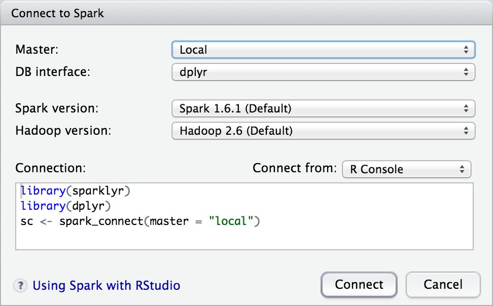

```{r setup, include = FALSE}
knitr::opts_chunk$set(eval = FALSE)
```

## Deployment

There are two well supported deployment modes for **sparklyr**: 

- Local --- Working on a local desktop typically with smaller/sampled datasets
- Cluster --- Working directly within or alongside a Spark cluster.

### Local Deployment

Local mode is an excellent way to learn and experiment with Spark. Local mode also provides a convenient development environment for analyses, reports, and applications that you plan to eventually deploy to a multi-node Spark cluster.

To work in local mode you should first install a version of Spark for local use. You can do this using the [spark_install](reference/sparklyr/latest/spark_install.html) function, for example:

```{r}
spakrlyr::spark_install(version = "1.6.1", hadoop_version = "2.6")
```

To connect to the local Spark instance you pass "local" as the value of the Spark master node to [spark_connect](reference/sparklyr/latest/spark_connect.html):

```{r}
library(sparklyr)
sc <- spark_connect(master = "local")
```

For the local development scenario, see the [Configuration] section below for details on how to have the same code work seamlessly in both development and production environments.

### Cluster Deployment

To use spaklyr with a remote Spark cluster you should locate your R session on a machine that is either directly on one of the cluster nodes or is close to the cluster (for networking performance). In the case where R is not running directly on the cluster you should also ensure that the machine has a Spark version and configuration **identical** to that of the cluster nodes.

The most straightforward way to run R within or near to the cluster is either a remote SSH session or via  [RStudio Server](https://www.rstudio.com/products/rstudio/).

In cluster mode you use the version of Spark already deployed on the cluster node. This version is located via the `SPARK_HOME` environment variable, so you should be sure that this variable is correctly defined on your server before attempting a connection.

To connect, pass the address of the master node to [spark_connect](reference/sparklyr/latest/spark_connect.html), for example:

```{r}
library(sparklyr)
sc <- spark_connect(master = "spark://local:7077")
```

If you are running on EC2 using the Spark [EC2 deployment scripts](http://spark.apache.org/docs/latest/ec2-scripts.html) then you can read the master from `/root/spark-ec2/cluster-url`, for example:

```{r}
library(sparklyr)
master <- system('cat /root/spark-ec2/cluster-url', intern=TRUE)
sc <- spark_connect(master)
```

### Connection Tools

You can view the Spark web UI via the [spark_web](reference/sparklyr/latest/spark_web.html) function, and view the Spark log via the [spark_log](reference/sparklyr/latest/spark_log.html) function:

```{r}
spark_web(sc)
spark_log(sc)
```

You can disconnect from Spark using the [spark_disconnect](reference/sparklyr/latest/spark_disconnect.html) function:

```{r}
spark_disconnect(sc)
```


## Configuration 

This section describes the various options available for configuring both the behavior of the **sparklyr** package as well as the underlying Spark cluster. Creating multiple configuration profiles (e.g. development, test, production) is also covered.

### Config Files

The configuration for a Spark connection is specified via the `config` parameter of the [spark_connect](reference/sparklyr/latest/spark_connect.html) function. By default the configuration is established by calling the [spark_config](reference/sparklyr/latest/spark_config.html) function. This code represents the default behavior:

```{r}
spark_connect(master = "local", config = spark_config())
```

By default the [spark_config](reference/sparklyr/latest/spark_config.html) function reads configuration data from a file named `config.yml` located in the current working directory (or in parent directories if not located in the working directory). This file is not required and only need be provided for overriding default behavior. You can also specify an alternate config file name and/or location.

The `config.yml` file is in turn processed using the [config](https://github.com/rstudio/config) package, which enables support for multiple named configuration profiles.

### Package Options

There are a number of options available to configure the behavior of the sparklyr package:

| Option | Description  |
|----------------------------|---------------------------------------------|
| `sparklyr.defaultPackages`| Spark packages to automatically include within session (defaults to "com.databricks:spark-csv_2.11:1.3.0" and "com.amazonaws:aws-java-sdk-pom:1.10.34") |
| `sparklyr.cores.local` | Number of cores to use when running in local mode (defaults to `parallel::detectCores`) |
| `sparklyr.shell.*` | Command line parameters to pass to `spark-shell` (see the [Spark documentation](https://spark.apache.org/docs/latest/submitting-applications.html) for details on supported options) |

For example, this configuration file sets the number of local cores to 4 and the amount of memory allocated for the Spark driver to 2G:

```yaml
default:
  sparklyr.cores.local: 4
  sparklyr.shell.driver-memory: 4GB
```

Note that the use of `default` will be explained below in [Multiple Profiles].

### Spark Options

You can also use `config.yml` to specify arbitrary Spark configuration properties:

| Option | Description  |
|----------------------------|---------------------------------------------|

| `spark.*` Arbitrary configuration properties (applied by creating a `SparkConf` containing the specified properties). See the [Spark Configuration](http://spark.apache.org/docs/latest/configuration.html) for documentation on available properties.
| `spark.sql.*`| Arbitrary configuration properties for Spark SQL (applied using SET). See the Spark [SQL Programming Guide](http://spark.apache.org/docs/latest/sql-programming-guide.html) for documentation on available properties. |

For example, this configuration file set a custom scratch directory for Spark and specifies 100 as the number of partitions to use when shuffling data for joins or aggregations:

```yaml
default:
  spark.local.dir: /tmp/spark-scratch
  spark.sql.shuffle.partitions: 100
```

### User Options

You can also include arbitrary custom user options within the `config.yml` file. These can be named anything you like so long as they *do not* use either `spark` or `sparklyr` as a prefix. For example, this configuration file defines `dataset` and `sample-size` options:

```yaml
default:
  dataset: "observations.parquet"
  sample-size: 10000
```

### Multiple Profiles

The [config](https://github.com/rstudio/config) package enables the definition of multiple named configuration profiles for different environments (e.g. default, test, production). All environments automatically inherit from the `default` environment and can optionally also inherit from each other.

For example, you might want to use a distinct datasets for development and testing or might want to use custom Spark configuration properties that are only applied when running on a production cluster. Here's how that would expressed in `config.yml`:

```yaml
default:
  dataset: "observations-dev.parquet"
  sample-size: 10000
  
production:
  spark.memory.fraction: 0.9
  spark.rdd.compress: true
  dataset: "observations.parquet"
  sample-size: null
```

You can also use this feature to specify distinct Spark master nodes for different environments, for example:

```yaml
default:
  spark.master: "local"
  
production:
  spark.master: "spark://local:7077"
```

With this configuration, you can omit the `master` argument entirely from the call to [spark_connect](reference/sparklyr/latest/spark_connect.html):

```{r}
sc <- spark_connect()
```

Note that the currently active configuration is determined via the value of `R_CONFIG_ACTIVE` environment variable. See the [config package documentation](https://github.com/rstudio/config) for additional details.

## RStudio Server

RStudio Server provides a web-based IDE interface to a remote R session, making it ideal for use as a front-end to a Spark cluster. This section covers some additional configuration options that are useful for RStudio Server.

### Connection Options

The RStudio IDE provides a **New Connection** dialog to assist in connecting with both local instances of Spark and Spark clusters:



You can configure what connection choices are presented using the `rstudio.spark.connections` option. By default, users are presented with possibility of both local and cluster connections, however, you can modify this behavior to present only one of these, or even a specific Spark master URL. Some commonly used combinations of connection choices include:

| Value | Description  |
|----------------------------|---------------------------------------------|
| `c("local", "cluster")` | Default. Present connections to both local and cluster Spark instances. |
| `"local"`| Present only connections to local Spark instances. |
| `"cluster"`| Present only connections to Spark clusters. |
| `"spark://local:7077"`| Present only a connection to a specific Spark cluster. |
| `c("spark://local:7077", "cluster")`| Present a connection to a specific Spark cluster and other clusters. |

This option should generally be set within [Rprofile.site](https://stat.ethz.ch/R-manual/R-devel/library/base/html/Startup.html). For example:

```{r}
options(rstudio.spark.connections = "spark://local:7077")
```


### Spark Installations

If you are running within local mode (as opposed to cluster mode) you may want to provide pre-installed Spark version(s) to be shared by all users of the server. You can do this by installing Spark versions within a shared directory (e.g. `/opt/spark`) then designating it as the Spark installation directory. 

For example, after installing one or more versions of Spark to `/opt/spark` you would add the following to [Rprofile.site](https://stat.ethz.ch/R-manual/R-devel/library/base/html/Startup.html):

```{r}
options(spark.install.dir = "/opt/spark")
```

If this directory is read-only for ordinary users then RStudio will not offer installation of additional versions, which will help guide users to a version that is known to be compatible with versions of Spark deployed on clusters in the same organization.


