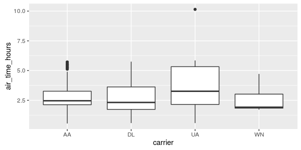

```{r setup, include=FALSE}
knitr::opts_chunk$set(eval = FALSE)
```


# Overview

`dplyr` is an R package for working with structured data both in and outside of R. `dplyr` makes data manipulation for R users easy, consistent, and high performant. You can load `dplyr` by running:

```{r, message=FALSE, warning=FALSE}
library("dplyr")
```

Use `dplyr` as your main interface for manipulating Spark dataframes. It gives you the ability to:

* [Operate on a DataFrame (select, filter, aggregate, etc.)](#operate-on-a-dataframe)
* [Use window functions](#use-window-functions)
* [Join DataFrames](#join-dataframes)
* [Sample data](#sample-data)
* [Cache DataFramea](#cache-dataframes)

Statements in `dplyr` can be chained together using pipes defined by the [magrittr](https://cran.r-project.org/web/packages/magrittr/vignettes/magrittr.html) R package. `dplyr` also supports [non-standard evalution](https://cran.r-project.org/web/packages/dplyr/vignettes/nse.html) of its arguments. For more information on `dplyr`, see the [introduction](https://cran.r-project.org/web/packages/dplyr/vignettes/introduction.html), a guide for connecting to [databases](https://cran.r-project.org/web/packages/dplyr/vignettes/databases.html), and a variety of [vignettes](https://cran.r-project.org/web/packages/dplyr/index.html).

# Setup

To explore the basic data manipulation verbs of dplyr, we'll start with data stored in the `nycflights13` R package. This package contains data for all 336,776 flights departing New York City in 2013. It also includes useful metadata on airlines, airports, weather, and planes. The data comes from the US [Bureau of Transportation Statistics](http://www.transtats.bts.gov/DatabaseInfo.asp?DB_ID=120&Link=0), and is documented in `?nycflights13`

Connect to the cluster and copy the flights data using the `copy_to` function. Caveat: The flight data in `nycflights13` is convenient for `dplyr` demonstrations because it is small, but in practice large data will rarely be copied directly from R objects. 


```{r message=FALSE, warning=FALSE}
library(sparklyr)
library(nycflights13)
sc <- spark_connect()
flights <- copy_to(sc, flights, "flights")
airlines <- copy_to(sc, airlines, "airlines")
src_tbls(sc)
```

```
[1] "airlines" "flights"
```

# Operate on a DataFrame

## dplyr verbs

Verbs are `dplyr` commands for manipulating data. When connected to a Spark DataFrame, dplyr translates the commands into Spark SQL statements. Remote data sources use exactly the same five verbs as local data sources. Here are the five verbs with their corresponding SQL commands:

* `select` ~ `SELECT`
* `filter` ~ `WHERE`
* `arrange` ~ `ORDER`
* `summarise` ~ `aggregators: sum, min, sd, etc.`
* `mutate` ~ `operators: +, *, log, etc.`

```{r}
select(flights, year:day, arr_delay, dep_delay)
```
```
Source:   query [?? x 5]
Database: spark connection master=local app=sparklyr local=TRUE

# S3: tbl_spark
    year month   day arr_delay dep_delay
   <int> <int> <int>     <dbl>     <dbl>
1   2013     1     1        11         2
2   2013     1     1        20         4
3   2013     1     1        33         2
4   2013     1     1       -18        -1
5   2013     1     1       -25        -6
6   2013     1     1        12        -4
7   2013     1     1        19        -5
8   2013     1     1       -14        -3
9   2013     1     1        -8        -3
10  2013     1     1         8        -2
... with more rows
```
```{r}
filter(flights, dep_delay > 1000)
```
```
Source:   query [?? x 19]
Database: spark connection master=local app=sparklyr local=TRUE

# S3: tbl_spark
   year month   day dep_time sched_dep_time dep_delay
  <int> <int> <int>    <int>          <int>     <dbl>
1  2013     1     9      641            900      1301
2  2013     1    10     1121           1635      1126
3  2013     6    15     1432           1935      1137
4  2013     7    22      845           1600      1005
5  2013     9    20     1139           1845      1014
... with 13 more variables: arr_time <int>,
  sched_arr_time <int>, arr_delay <dbl>, carrier <chr>,
  flight <int>, tailnum <chr>, origin <chr>, dest <chr>,
  air_time <dbl>, distance <dbl>, hour <dbl>, minute <dbl>,
  time_hour <dbl>
```
```{r}
arrange(flights, desc(dep_delay))
```
```
Source:   query [?? x 19]
Database: spark connection master=local app=sparklyr local=TRUE

# S3: tbl_spark
    year month   day dep_time sched_dep_time dep_delay
   <int> <int> <int>    <int>          <int>     <dbl>
1   2013     1     9      641            900      1301
2   2013     6    15     1432           1935      1137
3   2013     1    10     1121           1635      1126
4   2013     9    20     1139           1845      1014
5   2013     7    22      845           1600      1005
6   2013     4    10     1100           1900       960
7   2013     3    17     2321            810       911
8   2013     6    27      959           1900       899
9   2013     7    22     2257            759       898
10  2013    12     5      756           1700       896
... with more rows, and 13 more variables: arr_time <int>,
  sched_arr_time <int>, arr_delay <dbl>, carrier <chr>,
  flight <int>, tailnum <chr>, origin <chr>, dest <chr>,
  air_time <dbl>, distance <dbl>, hour <dbl>, minute <dbl>,
  time_hour <dbl>
```
```{r}
summarise(flights, mean_dep_delay = mean(dep_delay))
```
```
Source:   query [?? x 1]
Database: spark connection master=local app=sparklyr local=TRUE

# S3: tbl_spark
  mean_dep_delay
           <dbl>
1       12.63907
```
```{r, eval=FALSE}
mutate(flights, speed = distance / air_time * 60)
```
## Laziness

When working with databases, dplyr tries to be as lazy as possible:

* It never pulls data into R unless you explicitly ask for it.

* It delays doing any work until the last possible moment: it collects together
  everything you want to do and then sends it to the database in one step.

For example, take the following code:

```{r}
c1 <- filter(flights, day == 17, month == 5, carrier %in% c('UA', 'WN', 'AA', 'DL'))
c2 <- select(c1, year, month, day, carrier, dep_delay, air_time, distance)
c3 <- arrange(c2, year, month, day, carrier)
c4 <- mutate(c3, air_time_hours = air_time / 60)
```

This sequence of operations never actually touches the database. It's not until you ask for the data (e.g. by printing `c4`) that dplyr requests the results from the database.

```{r, eval=FALSE}
c4
```

## Collect, compute, collapse

You can copy data from Spark into R's memory by using `collect()`. 
```{r}
library(ggplot2)
carrierhours <- collect(c4)
```

`collect()` executes the Spark query and returns the results to R for further analysis and visualization.

```{r}
with(carrierhours, pairwise.t.test(air_time, carrier))
```
```

	Pairwise comparisons using t tests with pooled SD 

data:  air_time and carrier 

   AA      DL      UA     
DL 0.25057 -       -      
UA 0.07957 0.00044 -      
WN 0.07957 0.23488 0.00041

P value adjustment method: holm 
```
```{r}
ggplot(carrierhours, aes(carrier, air_time_hours)) + geom_boxplot()
```



If you want to execute a query and store the results in a temporary table, use `compute()`

```{r}
compute(c4, 'carrierspeed')
src_tbls(sc)
```
```
[1] "airlines"     "carrierspeed" "flights"     
```

Finally, you can use `collapse()` to turn the query into a table expression.

## Chaining commands via pipes

You can use pipes to write cleaner syntax. Using the same example from above, you can write a much cleaner version like this:

```{r, eval=FALSE}
flights %>%
  filter(day == 17, month == 5, carrier %in% c('UA', 'WN', 'AA', 'DL')) %>%
  select(year, month, day, carrier, dep_delay, air_time, distance) %>%
  arrange(year, month, day, carrier) %>%
  mutate(air_time_hours = air_time / 60)
```

## Grouping

The `group_by` function corresponds to the `GROUP BY` statement in SQL.

```{r}
flights %>%
  group_by(carrier) %>%
  summarize(count = n(), mean_dep_delay = mean(dep_delay)) %>%
  arrange(desc(mean_dep_delay)) %>%
  filter(count > 10000)
```
```
Source:   query [?? x 3]
Database: spark connection master=local app=sparklyr local=TRUE

# S3: tbl_spark
  carrier count mean_dep_delay
    <chr> <dbl>          <dbl>
1      EV 54173      19.955390
2      WN 12275      17.711744
3      9E 18460      16.725769
4      B6 54635      13.022522
5      UA 58665      12.106073
6      MQ 26397      10.552041
7      DL 48110       9.264505
8      AA 32729       8.586016
9      US 20536       3.782418
```

## Translate SQL

dplyr knows how to convert the following R functions to Spark SQL:

```{r, eval = FALSE}
+, -, *, /, %%, ^
abs, acos, acosh, asin, asinh, atan, atan2, atanh, ceiling, cos, cosh, cot, coth, exp, floor, log, log10, round, sign, sin, sinh, sqrt, tan, tanh
<, <=, !=, >=, >, ==, %in%
&, &&, |, ||, !, xor
mean, sum, min, max, sd, var
```


# Use window functions

`dplyr` supports Spark SQL window functions. Window functions are used in conjunction with mutate and filter to solve a wide range of problems. You can compare the `dplyr` syntax to the query it has generated by using `sql_render()`.

```{r, collapse=TRUE}
# Find the most and least delayed flight each day
bestworst <- flights %>%
  group_by(year, month, day) %>%
  select(dep_delay) %>% 
  filter(dep_delay == min(dep_delay) || dep_delay == max(dep_delay))
sql_render(bestworst)
```
```
<SQL> SELECT `year`, `month`, `day`, `dep_delay`
FROM (SELECT `year`, `month`, `day`, `dep_delay`, min(`dep_delay`) OVER (PARTITION BY `year`, `month`, `day`) AS `zzz16`, max(`dep_delay`) OVER (PARTITION BY `year`, `month`, `day`) AS `zzz17`
FROM (SELECT `year` AS `year`, `month` AS `month`, `day` AS `day`, `dep_delay` AS `dep_delay`
FROM `flights`) `ergulayaaq`) `rwcwyyloyj`
WHERE (`dep_delay` = `zzz16` OR `dep_delay` = `zzz17`)
```
```{r}
# Rank each flight within a daily
ranked <- flights %>%
  group_by(year, month, day) %>%
  select(dep_delay) %>% 
  mutate(rank = rank(desc(dep_delay)))
sql_render(ranked)
```
```
<SQL> SELECT `year`, `month`, `day`, `dep_delay`, rank() OVER (PARTITION BY `year`, `month`, `day` ORDER BY `dep_delay` DESC) AS `rank`
FROM (SELECT `year` AS `year`, `month` AS `month`, `day` AS `day`, `dep_delay` AS `dep_delay`
FROM `flights`) `hsqqhfbsyl`
```

# Join DataFrames

It's rare that a data analysis involves only a single table of data. In practice, you'll normally have many tables that contribute to an analysis, and you need flexible tools to combine them. In dplyr, there are three families of verbs that work with two tables at a time:

* Mutating joins, which add new variables to one table from matching rows in 
  another.

* Filtering joins, which filter observations from one table based on whether or 
  not they match an observation in the other table.

* Set operations, which combine the observations in the data sets as if they 
  were set elements.

All two-table verbs work similarly. The first two arguments are `x` and `y`, and provide the tables to combine. The output is always a new table with the same type as `x`.

```{r}
flights %>% left_join(airlines)
sql_render(flights %>% left_join(airlines))
tbl(sc, sql('select * from flights a left outer join airlines b on (a.carrier = b.carrier)'))
```


# Sample data

You can use `sample_n()` and `sample_frac()` to take a random sample of rows: use `sample_n()` for a fixed number and `sample_frac()` for a fixed fraction.

```{r}
sample_n(flights, 10)
sample_frac(flights, 0.01)
```


# Cache DataFrames

You can cache and unchace DataFrames with `tbl_cache()` and `tbl_uncache()`. Caching DataFrames forces them into memory, improving query performance.

```{r message=FALSE, warning=FALSE}
tbl_cache(sc, 'flights')
tbl_uncache(sc, 'flights')
```
