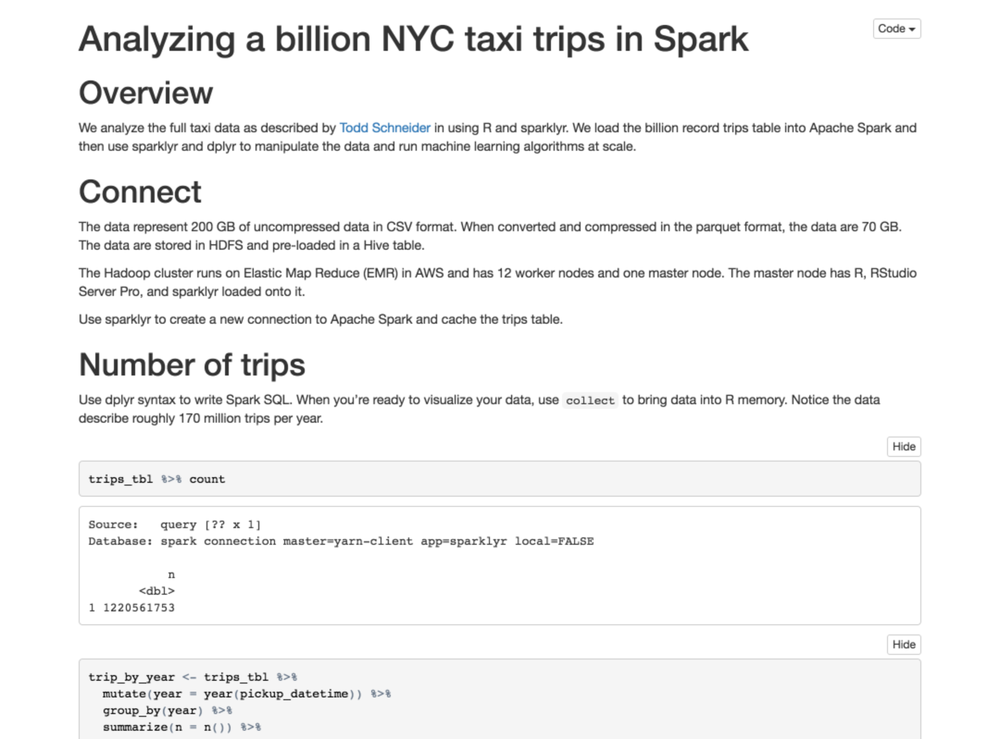

```{r setup, include=FALSE}
source("utils.R")
```

The examples below showcase R applications and analysis performed using Sparklyr. Analyses are conducted in [R Notebooks](http://rmarkdown.rstudio.com/r_notebooks.html) utilizing dplyr and machine learning functions. [flexdashboards](http://rmarkdown.rstudio.com/flexdashboard/index.html) and [Shiny Applications](http://shiny.rstudio.com) showcase interactive dashboards with active Spark connections.

<br>

## Analyzing 200 GB with Spark and R [](https://github.com/rstudio/sparkDemos/tree/master/prod/notebooks/taxi_demo)

<!--html_preserve-->

<div class="row">

<div class="col-sm-1"></div>

<div class="col-sm-6">
<iframe src="https://drive.google.com/file/d/0B4AYvf7e_RJQTFIwY3huanRmMHM/preview" width="416" height="236" webkitallowfullscreen mozallowfullscreen allowfullscreen></iframe>
</div>

<div class="col-sm-4">
<a class="thumbnail" title="Build Analytic Roll-Up in Spark" href="https://github.com/rstudio/sparkDemos/blob/master/prod/notebooks/taxi_demo/taxiDemo.Rmd">

<div class="caption">NYC Taxi Data - R Markdown Notebook</div>
</a>
</div>

<div class="col-sm-1"></div>

</div>


<!--/html_preserve-->

This example builds off of Todd Schneiders analysis of NYC Taxi Data. For details visit [Todd's repo](https://github.com/toddwschneider/nyc-taxi-data). The original postgres tables (**200 GB**) were transferred to S3 and then loaded into Hive tables on Amazon EMR. The analysis was conducted in an R Notebook and includes a [Shiny Gadget](http://shiny.rstudio.com/articles/gadgets.html). 

<br> 

## Notebooks [](https://github.com/rstudio/sparkDemos/tree/master/prod/notebooks)

```{r, echo=FALSE}
examples("notebook")
```

<br>

## Dashboards [](https://github.com/rstudio/sparkDemos/tree/master/prod/dashboards)


```{r, echo=FALSE}
examples("dashboard")
```

<br>

## Shiny Applications [](https://github.com/rstudio/sparkDemos/tree/master/prod/apps)


```{r, echo=FALSE}
examples("shiny")
```

