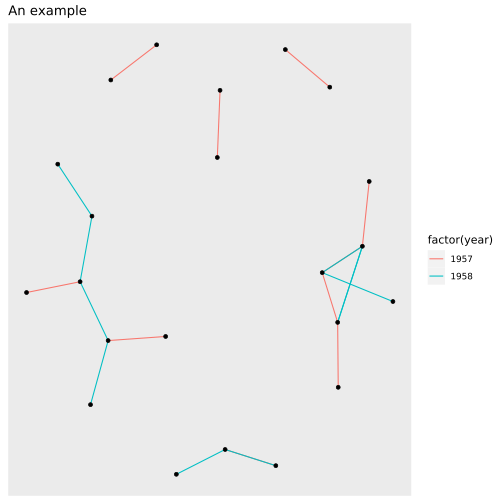

## Highlights

- Support for [GraphFrames](https://graphframes.github.io/graphframes/docs/_site/) which aims to provide the functionality of [GraphX](http://spark.apache.org/graphx/).
- Perform graph algorithms like: [PageRank](https://graphframes.github.io/graphframes/docs/_site/user-guide.html#pagerank), [ShortestPaths](https://graphframes.github.io/graphframes/docs/_site/user-guide.html#shortest-paths) and many others.
- Designed to work with [sparklyr](https://spark.rstudio.com) and the [sparklyr extensions](http://spark.rstudio.com/extensions.html).


## Installation

To install from CRAN, run:

```r
install.packages("graphframes")
```

For the development version, run:

```r
devtools::install_github("rstudio/graphframes")
```

## Examples

The examples make use of the `highschool` dataset from the `ggplot` package.

### Create a GraphFrame

The base for graph analyses in Spark, using `sparklyr`, will be a GraphFrame.

Open a new Spark connection using `sparklyr`, and copy the `highschool` data set


```r
library(graphframes)
library(sparklyr)
library(dplyr)

sc <- spark_connect(master = "local", version = "2.1.0")

highschool_tbl <- copy_to(sc, ggraph::highschool, "highschool")

head(highschool_tbl)
```

```
## # Source: spark<?> [?? x 3]
##    from    to  year
##   <dbl> <dbl> <dbl>
## 1     1    14  1957
## 2     1    15  1957
## 3     1    21  1957
## 4     1    54  1957
## 5     1    55  1957
## 6     2    21  1957
```

The vertices table is be constructed using `dplyr`.  The variable name expected by the GraphFrame is **id**.


```r
from_tbl <- highschool_tbl %>%
  distinct(from) %>%
  transmute(id = from)

to_tbl <- highschool_tbl %>%
  distinct(to) %>%
  transmute(id = to)


vertices_tbl <- from_tbl %>%
  sdf_bind_rows(to_tbl)

head(vertices_tbl)
```

```
## # Source: spark<?> [?? x 1]
##      id
##   <dbl>
## 1     1
## 2     3
## 3     4
## 4     6
## 5     7
## 6    12
```

The edges table can also be created using `dplyr`. In order for the GraphFrame to work,  the **from** variable needs be renamed **src**, and the **to** variable **dst**.

```r
# Create a table with <source, destination> edges
edges_tbl <- highschool_tbl %>%
  transmute(src = from, dst = to)
```

The `gf_graphframe()` function creates a new GraphFrame

```r
gf_graphframe(vertices_tbl, edges_tbl)
```

```
## GraphFrame
## Vertices:
##   Database: spark_connection
##   $ id <dbl> 1, 3, 4, 6, 7, 12, 13, 14, 16, 17, 19, 20, 22, 27, 31, 32, 33, 35,…
## Edges:
##   Database: spark_connection
##   $ src <dbl> 1, 1, 1, 1, 1, 2, 2, 3, 3, 4, 4, 4, 4, 5, 5, 6, 6, 6, 7, 8, 8, 9,…
##   $ dst <dbl> 14, 15, 21, 54, 55, 21, 22, 9, 15, 5, 18, 19, 43, 19, 43, 13, 20,…
```

### Basic Page Rank

We will calculate [PageRank](https://en.wikipedia.org/wiki/PageRank) over this dataset. The `gf_graphframe()` command can easily be piped into the `gf_pagerank()` function to execute the Page Rank.

```r
gf_graphframe(vertices_tbl, edges_tbl) %>%
  gf_pagerank(reset_prob = 0.15, max_iter = 10L, source_id = "1")
```

```
## GraphFrame
## Vertices:
##   Database: spark_connection
##   $ id       <dbl> 4, 4, 7, 7, 12, 12, 16, 16, 22, 22, 31, 31, 32, 32, 33, 33, …
##   $ pagerank <dbl> 8.568153e-04, 8.568153e-04, 3.609726e-04, 3.609726e-04, 1.21…
## Edges:
##   Database: spark_connection
##   $ src    <dbl> 1, 1, 1, 1, 1, 1, 1, 1, 1, 1, 1, 1, 1, 1, 1, 1, 1, 1, 1, 1, 1,…
##   $ dst    <dbl> 22, 22, 22, 22, 22, 22, 22, 22, 22, 22, 22, 22, 22, 22, 22, 22…
##   $ weight <dbl> 0.03125, 0.03125, 0.03125, 0.03125, 0.03125, 0.03125, 0.03125,…
```


Additionaly, one can calculate the degrees of vertices using `gf_degrees` as follows:


```r
gf_graphframe(vertices_tbl, edges_tbl) %>%
  gf_degrees()
```

```
## # Source: spark<?> [?? x 2]
##       id degree
##    <dbl>  <int>
##  1     1     10
##  2    14      7
##  3    54     23
##  4    55     25
##  5    22     30
##  6     3      2
##  7     4     13
##  8    19     20
##  9     6     10
## 10    13     16
## # … with more rows
```

### Visualizations

In order to visualize large `graphframe`s, one can use `sample_n` and then use `ggraph` with `igraph` to visualize the graph as follows:


```r
library(ggraph)
library(igraph)

graph <- highschool_tbl %>%
  sample_n(20) %>%
  collect() %>%
  graph_from_data_frame()

ggraph(graph, layout = 'kk') +
    geom_edge_link(aes(colour = factor(year))) +
    geom_node_point() +
    ggtitle('An example')
```




## Additional functions

Apart from calculating `PageRank` using `gf_pagerank`, the following functions are available:

- `gf_bfs()`: Breadth-first search (BFS).
- `gf_connected_components()`: Connected components.
- `gf_shortest_paths()`: Shortest paths algorithm.
- `gf_scc()`: Strongly connected components.
- `gf_triangle_count`: Computes the number of triangles passing through each vertex and others.


