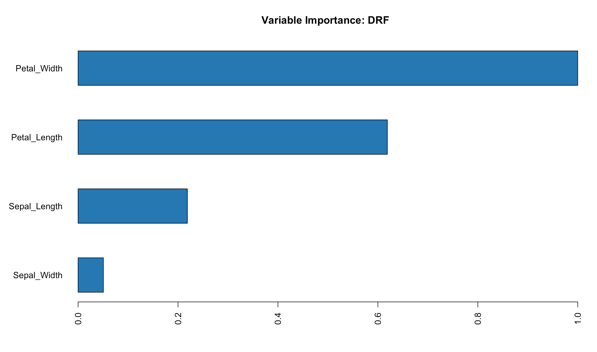

```{r setup, include=FALSE}
knitr::opts_chunk$set(eval = FALSE)
```

## Overview

The **rsparkling** extension package provides bindings to H2O's distributed [machine learning](http://www.h2o.ai/product/algorithms/) algorithms via **sparklyr**. In particular, rsparkling allows you to access the machine learning routines provided by the [Sparkling Water](http://www.h2o.ai/product/sparkling-water/) Spark package.  

Together with sparklyr's [dplyr](dplyr.html) interface, you can easily create and tune H2O machine learning workflows on Spark, orchestrated entirely within R.

[rsparkling](https://github.com/h2oai/sparkling-water/tree/master/r) provides a few simple conversion functions that allow the user to transfer data between Spark DataFrames and H2O Frames.  Once the Spark DataFrames are available as H2O Frames, the **h2o** R interface can be used to train H2O machine learning algorithms on the data.

A typical machine learning pipeline with rsparkling might be composed of the following stages. To fit a model, you might need to:

1. Perform SQL queries through the sparklyr [dplyr](dplyr.html) interface,
2. Use the `sdf_*` and `ft_*` family of functions to generate new columns, or partition your data set,
3. Convert your training, validation and/or test data frames into H2O Frames using the `as_h2o_frame` function,
3. Choose an appropriate H2O machine learning algorithm to model your data,
4. Inspect the quality of your model fit, and use it to make predictions with new data.

## Installation {.toc-ignore}

The **rsparkling** R package requires the **h2o** and **sparklyr** R packages to run.  The sparklyr package can be installed from CRAN and instructions for how to install the h2o and rsparkling packages follow below.

### Install h2o

Today (Sept. 2016, the initial github release of rsparkling) you must use **h2o** R package version [3.10.0.6](http://h2o-release.s3.amazonaws.com/h2o/rel-turing/6/index.html#R) (H2O "Turing" release, build 6) and Spark 1.6, since that version of H2O is embedded in rsparkling.  This will be more flexible in the future.

```r
# Remove previous versions of h2o R package
if ("package:h2o" %in% search()) detach("package:h2o", unload=TRUE)
if ("h2o" %in% rownames(installed.packages())) remove.packages("h2o")

# Next, we download R package dependencies
pkgs <- c("methods","statmod","stats","graphics",
          "RCurl","jsonlite","tools","utils")
for (pkg in pkgs) {
    if (!(pkg %in% rownames(installed.packages()))) install.packages(pkg)
}

# Download h2o package version 3.10.0.6
install.packages("h2o", type = "source", 
                 repos = "http://h2o-release.s3.amazonaws.com/h2o/rel-turing/6/R")
```


### Install rsparkling

The latest stable version of **rsparkling** can be installed using [devtools](https://cran.r-project.org/web/packages/devtools/index.html) as follows:

```r
library(devtools)
devtools::install_github("h2oai/sparkling-water", subdir = "/r/rsparkling")
``` 

## Algorithms

Once the `H2OContext` is made available to Spark (as demonstrated below), all of the functions in the standard h2o R interface can be used with H2O Frames (converted from Spark DataFrames).  Here is a table of the available algorithms:

| Function | Description  |
|----------------------------|---------------------------------------------|
| [`h2o.glm`](http://docs.h2o.ai/h2o/latest-stable/h2o-docs/data-science/glm.html) | Generalized Linear Model |
| [`h2o.deeplearning`](http://docs.h2o.ai/h2o/latest-stable/h2o-docs/data-science/deep-learning.html) | Multilayer Perceptron |
| [`h2o.randomForest`](http://docs.h2o.ai/h2o/latest-stable/h2o-docs/data-science/drf.html) | Random Forest |
| [`h2o.gbm`](http://docs.h2o.ai/h2o/latest-stable/h2o-docs/data-science/gbm.html) | Gradient Boosting Machine |
| [`h2o.naiveBayes`](http://docs.h2o.ai/h2o/latest-stable/h2o-docs/data-science/naive-bayes.html) | Naive-Bayes |
| [`h2o.prcomp`](http://docs.h2o.ai/h2o/latest-stable/h2o-docs/data-science/pca.html) | Principal Components Analysis |
| [`h2o.svd`](https://www.rdocumentation.org/packages/h2o/versions/3.8.3.3/topics/h2o.svd) | Singular Value Decomposition |
| [`h2o.glrm`](http://docs.h2o.ai/h2o/latest-stable/h2o-docs/data-science/glrm.html) | Generalized Low Rank Model |
| [`h2o.kmeans`](http://docs.h2o.ai/h2o/latest-stable/h2o-docs/data-science/k-means.html) | K-Means Clustering |
| [`h2o.anomaly`](https://www.rdocumentation.org/packages/h2o/versions/3.8.3.3/topics/h2o.anomaly) | Anomaly Detection via Deep Learning Autoencoder |

Additionally, the [h2oEnsemble](https://github.com/h2oai/h2o-3/tree/master/h2o-r/ensemble) R package can be used to generate Super Learner ensembles of H2O algorithms:

| Function | Description  |
|----------------------------|---------------------------------------------|
| [`h2o.ensemble`](http://learn.h2o.ai/content/tutorials/ensembles-stacking/) | Super Learner / Stacking |
| [`h2o.stack`](https://github.com/h2oai/h2o-3/blob/master/h2o-r/ensemble/demos/h2o_stack_documentation_example.R) | Super Learner / Stacking |


### Algorithm Example {.toc-ignore}

Let's walk through a simple example to demonstrate the use of H2O's machine learning algorithms within R. We'll use [h2o.glm](http://docs.h2o.ai/h2o/latest-stable/h2o-docs/data-science/glm.html) to fit a linear regression model. Using the built-in `mtcars` dataset, we'll try to predict a car's fuel consumption (`mpg`) based on its weight (`wt`), and the number of cylinders the engine contains (`cyl`).

Prior to starting this example, Spark must be installed (this only needs to be run once).

```{r}
library(sparklyr)
spark_install(version = "1.6.2")
```

The call to `library(rsparkling)` will make the H2O functions available on the R search path and will also ensure that the dependencies required by the Sparkling Water package are included when we connect to Spark. 

First, we will initialize a local Spark connection, and copy the `mtcars` dataset into Spark.  

```{r}
library(rsparkling)
library(dplyr)

sc <- spark_connect("local", version = "1.6.2")
mtcars_tbl <- copy_to(sc, mtcars, "mtcars", overwrite = TRUE)
```

Now, let's perform some simple transformations -- we'll

1. Remove all cars with horsepower less than 100,
2. Produce a column encoding whether a car has 8 cylinders or not,
3. Partition the data into separate training and test data sets,
4. Fit a model to our training data set,
5. Evaluate our predictive performance on our test dataset.

<div style="height: 10px;"></div>

```{r}
# transform our data set, and then partition into 'training', 'test'
partitions <- mtcars_tbl %>%
  filter(hp >= 100) %>%
  mutate(cyl8 = cyl == 8) %>%
  sdf_partition(training = 0.5, test = 0.5, seed = 1099)
```

Now, we convert our training and test sets into H2O Frames using rsparkling conversion functions.  We have already split the data into training and test frames using dplyr.  

```{r}
training <- as_h2o_frame(sc, partitions$training)
test <- as_h2o_frame(sc, partitions$test)
```

Alternatively, we can use the `h2o.splitFrame()` function instead of `sdf_partition()` to partition the data within H2O instead of Spark (e.g. `partitions <- h2o.splitFrame(as_h2o_frame(mtcars_tbl), 0.5)`) 

```{r}
# fit a linear model to the training dataset
glm_model <- h2o.glm(x = c("wt", "cyl"), 
                     y = "mpg", 
                     training_frame = training,
                     lambda_search = TRUE)
```

For linear regression models produced by H2O, we can use either `print()` or `summary()` to learn a bit more about the quality of our fit.  The `summary()` method returns some extra information about scoring history and variable importance.

```{r}
print(glm_model)
```
```
Model Details:
==============

H2ORegressionModel: glm
Model ID:  GLM_model_R_1474576540794_2 
GLM Model: summary
    family     link
1 gaussian identity
                                regularization
1 Elastic Net (alpha = 0.5, lambda = 0.08201 )
                                                                lambda_search
1 nlambda = 100, lambda.max = 8.2006, lambda.min = 0.08201, lambda.1se = -1.0
  number_of_predictors_total
1                          2
  number_of_active_predictors
1                           2
  number_of_iterations training_frame
1                    0   frame_rdd_57

Coefficients: glm coefficients
      names coefficients
1 Intercept    36.390842
2       cyl    -1.580152
3        wt    -2.232329
  standardized_coefficients
1                 17.783333
2                 -2.505999
3                 -2.449461

H2ORegressionMetrics: glm
** Reported on training data. **

MSE:  3.262896
RMSE:  1.806349
MAE:  1.411069
RMSLE:  0.09689482
Mean Residual Deviance :  3.262896
R^2 :  0.865446
Null Deviance :290.9967
Null D.o.F. :11
Residual Deviance :39.15475
Residual D.o.F. :9
AIC :56.24591
```

The output suggests that our model is a fairly good fit, and that both a cars weight, as well as the number of cylinders in its engine, will be powerful predictors of its average fuel consumption. (The model suggests that, on average, heavier cars consume more fuel.)

Let's use our H2O model fit to predict the average fuel consumption on our test data set, and compare the predicted response with the true measured fuel consumption. We'll build a simple ggplot2 plot that will allow us to inspect the quality of our predictions.

```{r}
library(ggplot2)

# compute predicted values on our test dataset
pred <- h2o.predict(glm_model, newdata = test)
# convert from H2O Frame to Spark DataFrame
predicted <- as_spark_dataframe(sc, pred)

# extract the true 'mpg' values from our test dataset
actual <- partitions$test %>%
  select(mpg) %>%
  collect() %>%
  `[[`("mpg")

# produce a data.frame housing our predicted + actual 'mpg' values
data <- data.frame(
  predicted = predicted,
  actual    = actual
)
# a bug in data.frame does not set colnames properly; reset here 
names(data) <- c("predicted", "actual")

# plot predicted vs. actual values
ggplot(data, aes(x = actual, y = predicted)) +
  geom_abline(lty = "dashed", col = "red") +
  geom_point() +
  theme(plot.title = element_text(hjust = 0.5)) +
  coord_fixed(ratio = 1) +
  labs(
    x = "Actual Fuel Consumption",
    y = "Predicted Fuel Consumption",
    title = "Predicted vs. Actual Fuel Consumption"
  )
```


Although simple, our model appears to do a fairly good job of predicting a car's average fuel consumption.

As you can see, we can easily and effectively combine dplyr data transformation pipelines with the machine learning algorithms provided by H2O's Sparkling Water.


## Transformers

A model is often fit not on a dataset as-is, but instead on some transformation of that dataset. Spark provides [feature transformers](http://spark.apache.org/docs/latest/ml-features.html), facilitating many common transformations of data within a Spark DataFrame, and sparklyr exposes these within the `ft_*` family of functions.  Transformers can be used on Spark DataFrames, and the final training set can be sent to the H2O cluster for machine learning.  

| Function | Description  |
|----------------------------|---------------------------------------------|
| [`ft_binarizer`](reference/sparklyr/latest/ft_binarizer.html) | Threshold numerical features to binary (0/1) feature  |
| [`ft_bucketizer`](reference/sparklyr/latest/ft_bucketizer.html) | Bucketizer transforms a column of continuous features to a column of feature buckets |
| [`ft_discrete_cosine_transform`](reference/sparklyr/latest/ft_discrete_cosine_transform.html) | Transforms a length NN real-valued sequence in the time domain into another length NN real-valued sequence in the frequency domain |
| [`ft_elementwise_product`](reference/sparklyr/latest/ft_elementwise_product.html) | Multiplies each input vector by a provided weight vector, using element-wise multiplication. |
| [`ft_index_to_string`](reference/sparklyr/latest/ft_index_to_string.html) | Maps a column of label indices back to a column containing the original labels as strings |
| [`ft_quantile_discretizer`](reference/sparklyr/latest/ft_quantile_discretizer.html) | Takes a column with continuous features and outputs a column with binned categorical features |
| [`ft_sql_transformer`](reference/sparklyr/latest/ft_sql_transformer.html) | Implements the transformations which are defined by a SQL statement |
| [`ft_string_indexer`](reference/sparklyr/latest/ft_string_indexer.html) | Encodes a string column of labels to a column of label indices |
| [`ft_vector_assembler`](reference/sparklyr/latest/ft_vector_assembler.html) | Combines a given list of columns into a single vector column |


## Examples

We will use the `iris` data set to examine a handful of learning algorithms and transformers. The iris data set measures attributes for 150 flowers in 3 different species of iris.

```{r}
library(rsparkling)
library(ggplot2)
library(dplyr)
sc <- spark_connect("local", version = "1.6.2")
iris_tbl <- copy_to(sc, iris, "iris", overwrite = TRUE)
iris_tbl
```
```
Source:   query [?? x 5]
Database: spark connection master=local app=sparklyr local=TRUE

   Sepal_Length Sepal_Width Petal_Length Petal_Width Species
          <dbl>       <dbl>        <dbl>       <dbl>   <chr>
1           5.1         3.5          1.4         0.2  setosa
2           4.9         3.0          1.4         0.2  setosa
3           4.7         3.2          1.3         0.2  setosa
4           4.6         3.1          1.5         0.2  setosa
5           5.0         3.6          1.4         0.2  setosa
6           5.4         3.9          1.7         0.4  setosa
7           4.6         3.4          1.4         0.3  setosa
8           5.0         3.4          1.5         0.2  setosa
9           4.4         2.9          1.4         0.2  setosa
10          4.9         3.1          1.5         0.1  setosa
# ... with more rows
```
Convert to an H2O Frame:
```{r}
iris_hf <- as_h2o_frame(sc, iris_tbl)
```

### K-Means Clustering

Use H2O's [K-means clustering](http://docs.h2o.ai/h2o/latest-stable/h2o-docs/data-science/k-means.html) to partition a dataset into groups. K-means clustering partitions points into `k` groups, such that the sum of squares from points to the assigned cluster centers is minimized.

```{r}
kmeans_model <- h2o.kmeans(training_frame = iris_hf, 
                           x = 3:4,
                           k = 3,
                           seed = 1)
```


To look at particular metrics of the K-means model, we can use `h2o.centroid_stats()` and `h2o.centers()` or simply print out all the model metrics using `print(kmeans_model)`.

```{r}
# print the cluster centers
h2o.centers(kmeans_model)
```
```
  petal_length petal_width
1     1.462000     0.24600
2     5.566667     2.05625
3     4.296154     1.32500
```

```{r}
# print the centroid statistics
h2o.centroid_stats(kmeans_model)
```
```
Centroid Statistics: 
  centroid     size within_cluster_sum_of_squares
1        1 50.00000                       1.41087
2        2 48.00000                       9.29317
3        3 52.00000                       7.20274
```


### Logistic Regression

Use H2O's [logistic regression](http://docs.h2o.ai/h2o/latest-stable/h2o-docs/data-science/glm.html) to perform logistic regression, modeling a binary outcome as a function of one or more explanatory variables.  In this example, we also perform 3-fold cross-validation and evaluate the performance of the model.

```{r}
# Prepare beaver dataset
beaver <- beaver2
beaver$activ <- factor(beaver$activ, labels = c("Non-Active", "Active"))
beaver_hf <- as.h2o(beaver)  # Send data from R memory to H2O cluster

y <- "activ"
x <- setdiff(names(beaver_hf), y)
glm_model <- h2o.glm(x = x, 
                     y = y,
                     training_frame = beaver_hf,
                     family = "binomial",
                     nfolds = 3,
                     seed = 1)

h2o.performance(glm_model, xval = TRUE)
```
```
H2OBinomialMetrics: glm
** Reported on cross-validation data. **
** 3-fold cross-validation on training data (Metrics computed for combined holdout predictions) **

MSE:  0.01005471
RMSE:  0.1002732
LogLoss:  0.03547554
Mean Per-Class Error:  0
AUC:  1
Gini:  1
R^2:  0.957323
Null Deviance:  136.8121
Residual Deviance:  7.095109
AIC:  15.09511

Confusion Matrix for F1-optimal threshold:
           Active Non-Active    Error    Rate
Active         62          0 0.000000   =0/62
Non-Active      0         38 0.000000   =0/38
Totals         62         38 0.000000  =0/100

Maximum Metrics: Maximum metrics at their respective thresholds
                        metric threshold    value idx
1                       max f1  0.227019 1.000000  37
2                       max f2  0.227019 1.000000  37
3                 max f0point5  0.227019 1.000000  37
4                 max accuracy  0.227019 1.000000  37
5                max precision  0.999997 1.000000   0
6                   max recall  0.227019 1.000000  37
7              max specificity  0.999997 1.000000   0
8             max absolute_mcc  0.227019 1.000000  37
9   max min_per_class_accuracy  0.227019 1.000000  37
10 max mean_per_class_accuracy  0.227019 1.000000  37

Gains/Lift Table: Extract with `h2o.gainsLift(<model>, <data>)` or `h2o.gainsLift(<model>, valid=<T/F>, xval=<T/F>)`
```


### PCA

Use H2O's [Principal Components Analysis (PCA)](http://docs.h2o.ai/h2o/latest-stable/h2o-docs/data-science/pca.html) to perform dimensionality reduction. PCA is a statistical method to find a rotation such that the first coordinate has the largest variance possible, and each succeeding coordinate in turn has the largest variance possible.

```{r}
pca_model <- h2o.prcomp(training_frame = iris_hf,
                        x = 1:4,
                        k = 4,
                        seed = 1)
print(pca_model)
```
```
Model Details:
==============

H2ODimReductionModel: pca
Model ID:  PCA_model_R_1474576540794_7 
Importance of components: 
                            pc1      pc2      pc3      pc4
Standard deviation     7.861342 1.455041 0.283531 0.154411
Proportion of Variance 0.965303 0.033069 0.001256 0.000372
Cumulative Proportion  0.965303 0.998372 0.999628 1.000000


H2ODimReductionMetrics: pca
** Reported on training data. **
```

### Random Forest

Use H2O's [Random Forest](http://docs.h2o.ai/h2o/latest-stable/h2o-docs/data-science/drf.html) to perform regression or classification on a dataset.  We will continue to use the iris dataset as an example for this problem. 

As usual, we define the response and predictor variables using the `x` and `y` arguments.  Since we'd like to do a classification, we need to ensure that the response column is encoded as a factor (enum) column.

```{r}
y <- "Species"
x <- setdiff(names(iris_hf), y)
iris_hf[,y] <- as.factor(iris_hf[,y])
```

We can split the `iris_hf` H2O Frame into a train and test set (the split defaults to 75/25 train/test).
```{r}
splits <- h2o.splitFrame(iris_hf, seed = 1)
```

Then we can train a Random Forest model:
```{r}
rf_model <- h2o.randomForest(x = x, 
                             y = y,
                             training_frame = splits[[1]],
                             validation_frame = splits[[2]],
                             nbins = 32,
                             max_depth = 5,
                             ntrees = 20,
                             seed = 1)

```

Since we passed a validation frame, the validation metrics will be calculated.  We can retrieve individual metrics using functions such as `h2o.mse(rf_model, valid = TRUE)`.  The confusion matrix can be printed using the following:

```{r}
h2o.confusionMatrix(rf_model, valid = TRUE)
```
```
Confusion Matrix: vertical: actual; across: predicted
           setosa versicolor virginica  Error     Rate
setosa          7          0         0 0.0000 =  0 / 7
versicolor      0         13         0 0.0000 = 0 / 13
virginica       0          1        10 0.0909 = 1 / 11
Totals          7         14        10 0.0323 = 1 / 31
```

To view the variable importance computed from an H2O model, you can use either the `h2o.varimp()` or `h2o.varimp_plot()` functions:

```{r}
h2o.varimp_plot(rf_model)
```




### Gradient Boosting Machine

The [Gradient Boosting Machine (GBM)](http://docs.h2o.ai/h2o/latest-stable/h2o-docs/data-science/gbm.html) is one of H2O's most popular algorithms, as it works well on many types of data.  We will continue to use the iris dataset as an example for this problem. 

Using the same dataset and `x` and `y` from above, we can train a GBM:
```{r}
gbm_model <- h2o.gbm(x = x, 
                     y = y,
                     training_frame = splits[[1]],
                     validation_frame = splits[[2]],                     
                     ntrees = 20,
                     max_depth = 3,
                     learn_rate = 0.01,
                     col_sample_rate = 0.7,
                     seed = 1)
```

Since this is a multi-class problem, we may be interested in inspecting the confusion matrix on a hold-out set.  Since we passed along a `validatin_frame` at train time, the validation metrics are already computed and we just need to retreive them from the model object.

```{r}
h2o.confusionMatrix(gbm_model, valid = TRUE)
```
```
Confusion Matrix: vertical: actual; across: predicted
           setosa versicolor virginica  Error     Rate
setosa          7          0         0 0.0000 =  0 / 7
versicolor      0         13         0 0.0000 = 0 / 13
virginica       0          1        10 0.0909 = 1 / 11
Totals          7         14        10 0.0323 = 1 / 31
```

### Deep Learning

Use H2O's [Deep Learning](http://docs.h2o.ai/h2o/latest-stable/h2o-docs/data-science/deep-learning.html) to perform regression or classification on a dataset, extact non-linear features generated by the deep neural network, and/or detect anomalies using a deep learning model with auto-encoding.

In this example, we will load an example dataset from the h2o package directly into the H2O cluster to perform a regression.  However, in practice, the idea is to use the `as_h2o_frame()` function to transfer existing Spark DataFrames from Spark into H2O.

```{r}
path <- system.file("extdata", "prostate.csv", 
                    package = "h2o")
prostate_hf <- h2o.importFile(path)
head(prostate_hf)
```
```
  ID CAPSULE AGE RACE DPROS DCAPS  PSA  VOL GLEASON
1  1       0  65    1     2     1  1.4  0.0       6
2  2       0  72    1     3     2  6.7  0.0       7
3  3       0  70    1     1     2  4.9  0.0       6
4  4       0  76    2     2     1 51.2 20.0       7
5  5       0  69    1     1     1 12.3 55.9       6
6  6       1  71    1     3     2  3.3  0.0       8
```

Split the dataset into a train and test set:

```{r}
splits <- h2o.splitFrame(prostate_hf, seed = 1)
```

Next we define the response and predictor columns.

```{r}
y <- "VOL"
#remove response and ID cols
x <- setdiff(names(prostate_hf), c("ID", y))
```

Now we can train a deep neural net.

```{r}
dl_fit <- h2o.deeplearning(x = x, y = y,
                           training_frame = splits[[1]],
                           epochs = 15,
                           activation = "Rectifier",
                           hidden = c(10, 5, 10),
                           input_dropout_ratio = 0.7)
```

Evaluate performance on a test set:

```{r}
h2o.performance(dl_fit, newdata = splits[[2]])
```

```
H2ORegressionMetrics: deeplearning

MSE:  255.8092
RMSE:  15.99404
MAE:  13.12392
RMSLE:  1.895483
Mean Residual Deviance :  255.8092
```
Note that the above metrics are not reproducible when H2O's Deep Learning is run on multiple cores, however, the metrics should be fairly stable across repeat runs.


### Grid Search

H2O's grid search capabilities currently supports traditional (Cartesian) grid search and random grid search.  Grid search in R provides the following capabilities:

- `H2OGrid` class: Represents the results of the grid search
- `h2o.getGrid(<grid_id>, sort_by, decreasing)`: Display the specified grid
- `h2o.grid`: Start a new grid search parameterized by
    - model builder name (e.g., `algorithm = "gbm"`)
    - model parameters (e.g., `ntrees = 100`)
    - `hyper_parameters`: attribute for passing a list of hyper parameters (e.g., `list(ntrees=c(1,100), learn_rate=c(0.1,0.001))`)
    - `search_criteria`: optional attribute for specifying more a advanced search strategy

#### Cartesian Grid Search

By default, `h2o.grid()` will train a Cartesian grid search -- meaning, all possible models in the specified grid. In this example, we will re-use the prostate data as an example dataset for a regression problem.

```{r}
path <- system.file("extdata", "prostate.csv", 
                    package = "h2o")
prostate_hf <- h2o.importFile(path)
splits <- h2o.splitFrame(prostate_hf, seed = 1)

y <- "VOL"
#remove response and ID cols
x <- setdiff(names(prostate_hf), c("ID", y))
```


After prepping the data, we define a grid and execute the grid search.

```{r}
# GBM hyperparamters
gbm_params1 <- list(learn_rate = c(0.01, 0.1),
                    max_depth = c(3, 5, 9),
                    sample_rate = c(0.8, 1.0),
                    col_sample_rate = c(0.2, 0.5, 1.0))

# Train and validate a grid of GBMs
gbm_grid1 <- h2o.grid("gbm", x = x, y = y,
                      grid_id = "gbm_grid1",
                      training_frame = splits[[1]],
                      validation_frame = splits[[1]],
                      ntrees = 100,
                      seed = 1,
                      hyper_params = gbm_params1)

# Get the grid results, sorted by validation MSE
gbm_gridperf1 <- h2o.getGrid(grid_id = "gbm_grid1", 
                             sort_by = "mse", 
                             decreasing = FALSE)
print(gbm_gridperf1)
```

```
H2O Grid Details
================

Grid ID: gbm_grid 
Used hyper parameters: 
  -  col_sample_rate 
  -  learn_rate 
  -  max_depth 
  -  sample_rate 
Number of models: 36 
Number of failed models: 0 

Hyper-Parameter Search Summary: ordered by increasing mse
  col_sample_rate learn_rate max_depth sample_rate
1             1.0        0.1         9         1.0
2             0.5        0.1         9         1.0
3             1.0        0.1         9         0.8
4             0.5        0.1         9         0.8
5             1.0        0.1         5         0.8
          model_ids                mse
1 gbm_grid_model_35  88.10947523138782
2 gbm_grid_model_34  102.3118989994892
3 gbm_grid_model_17 103.50178587114236
4 gbm_grid_model_16  126.4217260351778
5 gbm_grid_model_11  149.6066650109763

---
   col_sample_rate learn_rate max_depth sample_rate
31             0.5       0.01         3         0.8
32             0.2       0.01         5         1.0
33             0.5       0.01         3         1.0
34             0.2       0.01         5         0.8
35             0.2       0.01         3         1.0
36             0.2       0.01         3         0.8
           model_ids                mse
31  gbm_grid_model_1  324.8117304723162
32 gbm_grid_model_24 325.10992525687294
33 gbm_grid_model_19 325.27898443785045
34  gbm_grid_model_6 329.36983845305735
35 gbm_grid_model_18 338.54411936919456
36  gbm_grid_model_0  339.7744828617712
```

#### Random Grid Search

H2O's Random Grid Search samples from the given parameter space until a set of constraints is met.  The user can specify the total number of desired models using (e.g. `max_models = 40`), the amount of time (e.g. `max_runtime_secs = 1000`), or tell the grid to stop after performance stops improving by a specified amount.  Random Grid Search is a practical way to arrive at a good model without too much effort.

The example below is set to run fairly quickly -- increase `max_runtime_secs` or `max_models` to cover more of the hyperparameter space in your grid search.  Also, you can expand the hyperparameter space of each of the algorithms by modifying the definition of `hyper_param` below.

```{r}
# GBM hyperparamters
gbm_params2 <- list(learn_rate = seq(0.01, 0.1, 0.01),
                    max_depth = seq(2, 10, 1),
                    sample_rate = seq(0.5, 1.0, 0.1),
                    col_sample_rate = seq(0.1, 1.0, 0.1))
search_criteria2 <- list(strategy = "RandomDiscrete", 
                         max_models = 50)

# Train and validate a grid of GBMs
gbm_grid2 <- h2o.grid("gbm", x = x, y = y,
                      grid_id = "gbm_grid2",
                      training_frame = splits[[1]],
                      validation_frame = splits[[2]],
                      ntrees = 100,
                      seed = 1,
                      hyper_params = gbm_params2,
                      search_criteria = search_criteria2)

# Get the grid results, sorted by validation MSE
gbm_gridperf2 <- h2o.getGrid(grid_id = "gbm_grid2", 
                             sort_by = "mse", 
                             decreasing = FALSE)
```

To get the best model, as measured by validation MSE, we simply grab the first row of the `gbm_gridperf2@summary_table` object, since this table is already sorted such that the lowest MSE model is on top. 

```{r}
gbm_gridperf2@summary_table[1,]
```
```
Hyper-Parameter Search Summary: ordered by increasing mse
  col_sample_rate learn_rate max_depth sample_rate
1             0.9       0.01         2         0.5
           model_ids                mse
1 gbm_grid4_model_36 243.67068252501582
```

In the examples above, we generated two different grids, specified by `grid_id`.  The first grid was called `grid_id = "gbm_grid1"` and the second was called `grid_id = "gbm_grid2"`.  However, if we are using the same dataset & algorithm in two grid searches, it probably makes more sense just to add the results of the second grid search to the first.  If you want to add models to an existing grid, rather than create a new one, you simply re-use the same `grid_id`.


## Exporting Models

There are two ways of exporting models from H2O -- saving models as a binary file, or saving models as pure Java code.

#### Binary Models

The more traditional method is to save a binary model file to disk using the `h2o.saveModel()` function.  To load the models using `h2o.loadModel()`, the same version of H2O that generated the models is required.  This method is commonly used when H2O is being used in a non-production setting.

A binary model can be saved as follows:

```{r}
h2o.saveModel(my_model, path = "/Users/me/h2omodels")
```

#### Java (POJO) Models 

One of the most valuable features of H2O is it's ability to export models as pure Java code, or rather, a "Plain Old Java Object" (POJO).  You can learn more about H2O POJO models in this [POJO quickstart guide](http://docs.h2o.ai/h2o/latest-stable/h2o-docs/pojo-quick-start.html). The POJO method is used most commonly when a model is deployed in a production setting.  POJO models are ideal for when you need very fast prediction response times, and minimal requirements -- the POJO is a standalone Java class with no dependencies on the full H2O stack.

To generate the POJO for your model, use the following command:

```{r}
h2o.download_pojo(my_model, path = "/Users/me/h2omodels")
```

You can learn more about how to take H2O models to production in the [productionizing H2O models](http://docs.h2o.ai/h2o/latest-stable/h2o-docs/productionizing.html) section of the H2O docs.

## Additional Resources

* [Main documentation site for Sparkling Water (and all H2O software projects)](http://docs.h2o.ai)
* [H2O.ai website](http://h2o.ai)

If you are new to H2O for machine learning, we recommend you start with the [Intro to H2O Tutorial](https://github.com/h2oai/h2o-tutorials/blob/master/h2o-open-tour-2016/chicago/intro-to-h2o.R), followed by the [H2O Grid Search & Model Selection Tutorial](https://github.com/h2oai/h2o-tutorials/blob/master/h2o-open-tour-2016/chicago/grid-search-model-selection.R).  There are a number of other H2O R [tutorials](https://github.com/h2oai/h2o-tutorials) and [demos](https://github.com/h2oai/h2o-3/tree/master/h2o-r/demos) available, as well as the [H2O World 2015 Training Gitbook](http://learn.h2o.ai/content/), and the [Machine Learning with R and H2O Booklet (pdf)](http://docs.h2o.ai/h2o/latest-stable/h2o-docs/booklets/RBooklet.pdf). 


