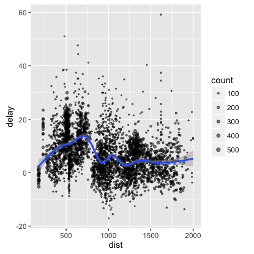
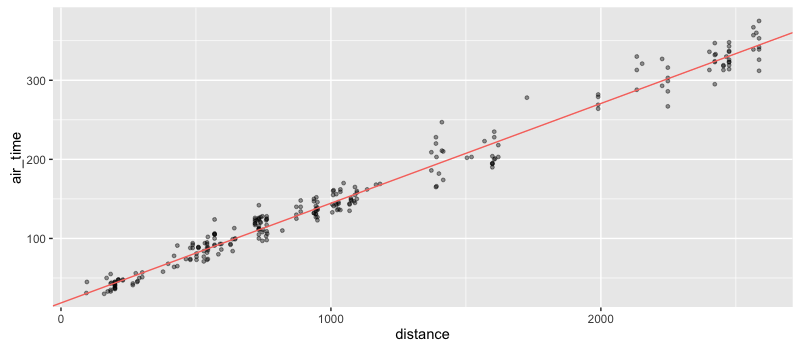

```{r setup, include=FALSE}
knitr::opts_chunk$set(eval = FALSE)
```

<div class="lead">

- Connect to [Spark](http://spark.apache.org/) from R --- sparklyr implements a complete [dplyr](https://github.com/hadley/dplyr) backend.
- Filter and aggregate Spark datasets then bring them into R for analysis and visualization.
- Leverage Spark's [MLlib](http://spark.apache.org/docs/latest/mllib-guide.html) (machine learning library) for distributed machine learning from R.
- API for creating extensions that call the full Spark API and/or Spark packages. 
- Tight integration with [RStudio IDE](#rstudio-ide) (managing connections, viewing datasets, etc.)

</div>

## Installation

Installation of sparklyr depends on the development versions of several other packages so currently requires a few steps. We'll soon publish sparklyr to CRAN which will simplify the installation considerably.

```{r, eval=FALSE}
# first install the development version of devtools
install.packages("devtools")
library(devtools)
install_github("hadley/devtools") 
reload(devtools::inst("devtools")) 

# install sparklyr using devtools
install_github("rstudio/sparklyr", auth_token = "1296316f10e7fe4adc675c77366265b5f180933d")
```

If you use the RStudio IDE, you should also download the latest [preview release](https://www.rstudio.com/products/rstudio/download/preview/) of the IDE which includes several enhancements for interacting with Spark (see the [RStudio IDE](#rstudio-ide) section below for more details).

## Connecting to Spark

If you're just getting started with Spark, sparklyr provides a way to run Spark on your local machine; in this mode, you don't need any additional servers or infrastructure. Alternatively, you can use sparklyr within a Spark cluster.

Below, you can find how to connect to either a local Spark instance or use sparklyr within a cluster. If you're using the RStudio IDE, you can click "New Connection" in the **Spark** pane and have it produce this code for you.

<ul class="nav nav-tabs">
  <li class="active"><a data-toggle="tab" href="#local">Local</a></li>
  <li><a data-toggle="tab" href="#cluster">Cluster</a></li>
</ul>
<div class="tab-content outlined-tab-content">
<div id="local" class="tab-pane fade in active">

To run in local mode you'll first need to install a local version of Spark. You can do this via the [install_spark](reference/sparklyr/latest/install_spark.html) function:

```{r}
library(sparklyr)
install_spark(version = "1.6.1")
```

You can connect to this local version of Spark by passing `"master = local"` to the [spark_connect](reference/sparklyr/latest/spark_connect.html) function:

```{r, eval=FALSE}
sc <- spark_connect(master = "local")
```
</div>
<div id="cluster" class="tab-pane fade">

To use sparklyr within a Spark cluster you should run [RStudio Server](https://www.rstudio.com/products/rstudio/) or an SSH session either directly on one of the cluster nodes or on a machine close to the cluster that has a Spark configuration identical to that of the cluster nodes.

In cluster mode sparklyr will locate the version of Spark to use via the `SPARK_HOME` environment variable, so you should be sure that this variable is correctly defined on your server before attempting a connection.

To connect, pass the address of the master node to [spark_connect](reference/sparklyr/latest/spark_connect.html), for example:

```{r}
library(sparklyr)
sc <- spark_connect(master = "spark://spark.example.com:7077")
```

Where `spark.example.com` is the address of your Spark cluster's master node, and `7077` is the port on which Spark is listening. If you are running directly on the master node then the address of the master would be typically be  `"spark://local:7077"`.

</div>
</div>

You can view the Spark web UI via the [spark_web](reference/sparklyr/latest/spark_web.html) function, and view the Spark log via the [spark_log](reference/sparklyr/latest/spark_log.html) function:

```{r}
spark_web(sc)
spark_log(sc)
```

You can disconnect from Spark using the [spark_disconnect](reference/sparklyr/latest/spark_disconnect.html) function:

```{r}
spark_disconnect(sc)
```


For additional information on deployment and configuration of Spark and sparklyr see the [Deployment](deployment.html) section.

## Spark DataFrames

A Spark DataFrame is a distributed collection of data organized into named columns. It is conceptually equivalent to a table in a relational database or a data frame in R/Python, but with richer optimizations under the hood. 

### dplyr Interface

The sparklyr package implements a [dplyr](https://github.com/hadley/dplyr) back-end for Spark DataFrames. To try out the dplyr interface you can copy an existing R `data.frame` into your Spark cluster. Assuming you already have a connection to a Spark cluster (as shown above) in the `sc` variable:

```{r, eval=FALSE}
library(dplyr)
iris_tbl <- copy_to(sc, iris)
```

This will copy the `iris` dataset to a Spark DataFrame named "iris". A reference to that DataFrame will be stored in the `iris_tbl` variable in R. 

Typically there will already be Spark DataFrames located within the cluster you are connecting to. You can obtain a reference to these data frames using the dplyr `tbl()` function: 

```{r, eval=FALSE}
iris_tbl2 <- tbl(sc, "iriss")
```

Both `iris_tbl` and `iris_tbl2` reference the exact same Spark DataFrame, and you can treat them like any other dplyr table.

```{r, eval=FALSE}
iris_tbl %>% 
  filter(Petal_Length < 1.2) %>% 
  collect()
```
```
Source: local data frame [2 x 5]

  Sepal_Length Sepal_Width Petal_Length Petal_Width Species
         <dbl>       <dbl>        <dbl>       <dbl>   <chr>
1          4.3         3.0          1.1         0.1  setosa
2          4.6         3.6          1.0         0.2  setosa
```

### Reading Data

sparklyr provides functions which enable reading from CSV, JSON, and [Parquet](http://parquet.apache.org/) formats. Each of the following functions reads the specified file into a DataFrame and returns a dplyr `tbl` reference to it:

| Function | Description  |
|----------------------------|---------------------------------------------|
| [`spark_read_csv`](reference/sparklyr/latest/spark_read_csv.html) | Reads a CSV file and provides a data source compatible with dplyr|
| [`spark_read_json`](reference/sparklyr/latest/spark_read_json.html) | Reads a JSON file and provides a data source compatible with dplyr |
| [`spark_read_parquet`](reference/sparklyr/latest/spark_read_json.html) | Reads a parquet file and provides a data source compatible with dplyr |

Regardless of the format of your data, Spark supports reading data from a variety of different data sources. These include data stored on HDFS, Amazon S3, or local files available to the Spark worker nodes. By default, sparklyr provides the necessary Spark packages to enable you to work with HDFS, S3, or local files.

#### Local Files

You read data from local files, but it's important to realize that the files are "local" *relative to the Spark worker nodes*. This means that a local file on the machine where you're running R, or even on your Spark master node will not be available.

```{r, eval=FALSE}
iris_tbl <- spark_read_csv(sc, "iris", "file:///iris.csv")
```

Reading local files is mostly useful for local development use cases, where you can reference any file on your local file-system using standard local paths (e.g. "~/Desktop/iris.csv").

#### HDFS

You can load data from HDFS via the `hdfs://` protocol:

```{r, eval=FALSE}
iris_tbl <- spark_read_json(
  sc, 
  "iris", 
  "hdfs://hdfs.company.org:9000/hdfs-path/iris.json")
```

#### S3

You can load data from Amazon S3 using the `s3n://` protocol:

```{r, eval=FALSE}
my_tbl <- spark_read_csv(
  sc, 
  "tblname", 
  "s3n://bucket-name/path/file-name.csv")
```

Note that if your S3 bucket is secure you'll need to make sure that the `AWS_ACCESS_KEY_ID` and `AWS_SECRET_ACCESS_KEY` environment variable are both defined. 

### Writing Data

It is often useful to save the results of your analysis or the tables that you have generated on your Spark cluster into persistent storage. The best option in many scenarios is to right the table out to a [Parquet](http://parquet.apache.org/) file.

```{r, eval=FALSE}
spark_write_parquet(
  tbl, 
  "hdfs://hdfs.company.org:9000/hdfs-path/data")
```

This will write the Spark DataFrame referenced by the `tbl` R variable to the given HDFS path. Of course, you could use any of the other persistence media discussed above (local file, S3, etc.).

## Data Manipulation

### dplyr Verbs

sparklyr implements a complete [dplyr](https://github.com/hadley/dplyr) back-end for data hosted in Spark. dplyr provides a rich set of verbs for data manipulation, including:

- `filter()` (and `slice()`)
- `group_by()`
- `arrange()`
- `select()` (and `rename()`)
- `distinct()`
- `mutate()` (and `transmute()`)
- `summarise()`
- `sample_n()` and `sample_frac()`

### Simple Example

If you have a dataset available in Spark, you can interact with it just as you would any other dplyr data source.

```{r, eval=FALSE}
iris_tbl <- tbl(db, "iris")

iris_tbl %>% 
  filter(Sepal_Length > 5) %>% 
  group_by(Species) %>% 
  summarize(
    plength = mean(Petal_Length), 
    pwidth=mean(Petal_Width)) %>% 
  collect()
```
```
Source: local data frame [3 x 3]

     Species  plength    pwidth
       <chr>    <dbl>     <dbl>
1 versicolor 4.317021 1.3468085
2     setosa 1.509091 0.2772727
3  virginica 5.573469 2.0326531
```

### Collecting into R

You can `collect()` the results of your dplyr sequence into your local R session and interact with it just like you do any other data. For example, here we use dplyr to collect a local data frame with summarized data on flight delays and then we plot it with ggplot2:

```{r, eval=FALSE}
delay <- tbl(sc, "flights") %>% 
  group_by(tailnum) %>%
  summarise(count = n(),  dist = mean(distance), 
            delay = mean(arr_delay)) %>%
  filter(count > 20,  dist < 2000,  !is.na(delay)) %>%
  collect

# plot delays
library(ggplot2)
ggplot(delay, aes(dist, delay)) +
  geom_point(aes(size = count), alpha = 1/2) +
  geom_smooth() +
  scale_size_area(max_size = 2)
```



For more information on data manipulation see the [dplyr](dplyr.html) section.

## Machine Learning

### Spark MLlib

Spark includes [MLlib](http://spark.apache.org/docs/latest/mllib-guide.html), a machine learning library that enables you to distribute machine learning operations across a Spark cluster. This is extremely useful if the data you want to do machine learning with is too large to fit within the memory of a single machine (the default mode for analysis in R).

These machine learning functions represent only a subset of the analytical functions available in the R ecosystem, but they can be useful for basic analysis on large data sets nonetheless. 

### Example: Linear Regression

Here's a simple example of such analysis using the flights data available in the `nycflights13` package. In reality, there are only 336k rows in this dataset which would easily fit into memory on most machines, but you can see the principles here which would apply to a much larger dataset.

We'll perform a linear regression between the `distance` traveled in a flight and the duration of the flight (`air_time`) using the [ml_linear_regression](reference/sparklyr/latest/ml_linear_regression.html) function in sparklyr. Note that we never actually load the dataset into memory on our local R session in these commands; the data and all analysis lives in Spark.

```{r, eval=FALSE}
# Fit a model on ALL the data -- which may be too big to download or analyze locally
model <- flights_tbl %>%
  filter(!is.na(distance), !is.na(air_time)) %>% 
  select(distance, air_time) %>%
  ml_linear_regression(response = "air_time", features = c("distance"))
```

Now that we have a model, let's download a small portion of the dataset (just 250 rows) and plot them against the linear regression we performed on the whole dataset.

```{r, eval=FALSE}
flights_tbl %>%
  filter(!is.na(distance),  !is.na(air_time)) %>% 
  select(distance, air_time) %>%
  sample_n(250) %>% 
  collect %>%
  ggplot(aes(distance, air_time)) +
  geom_point(aes(distance, air_time), 
             size = 1,  alpha = 0.4) +
  geom_abline(aes(
    slope = coef(model)[["distance"]],
    intercept = coef(model)[["(Intercept)"]],
    color = "red")) +
  theme(legend.position="none")
```



### Example: Random Forrest

Another example is the [ml_random_forest](reference/sparklyr/latest/ml_random_forest.html) function in sparklyr which constructs a random forest on the specified data hosted in Spark. Again, this example does not load the data into R nor does it download the data to your machine; the data and all analysis happens on the Spark cluster.

We'll construct a random forest to predict the departure delay given the day of the year.

```{r, eval=FALSE}
mForest <- flights_tbl %>%
  filter(!is.na(dep_delay)) %>% 
  ml_random_forest(
    response = "dep_delay",
    features = c("month", "day"),
    max.bins = 32L,
    max.depth = 5L,
    num.trees = 20L
  )
mPredict <- predict(mForest, flights_tbl)
```

You would now have predictions for how long a flight's departure would be delayed for each day of the year.

There are many more machine learning algorithms available, see the [MLlib](mllib.html) section for additional details.

## RStudio IDE

The latest RStudio [Preview Release](https://www.rstudio.com/products/rstudio/download/preview/) of the RStudio IDE includes integrated support for Spark and the sparklyr package, including tools for:

- Creating and managing Spark connections
- Browsing the tables and columns of Spark DataFrames
- Previewing the first 1,000 rows of Spark DataFrames

Once you've installed the sparklyr package, you should find a new pane entitled **Spark** within the IDE:


The Spark DataFrame preview uses the standard RStudio data viewer:


<div style="margin-bottom: 15px;"></div>

The RStudio IDE features for sparklyr are available now in the RStudio [Preview Release](https://www.rstudio.com/products/rstudio/download/preview/).


