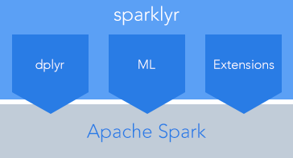

```{r setup, include=FALSE}
knitr::opts_chunk$set(eval = FALSE)
```

<div class="home">

<div class="lead">




- Connect to [Spark](http://spark.apache.org/) from R --- the sparklyr package provides a complete [dplyr](https://github.com/hadley/dplyr) backend.
- Filter and aggregate Spark datasets then bring them into R for analysis and visualization.
- Leverage Spark's [MLlib](http://spark.apache.org/docs/latest/mllib-guide.html) (machine learning library) for distributed machine learning from R.
- Create [extensions](extensions.html) that call the full Spark API and provide interfaces to Spark packages. 

</div>

<div class="homepage">

## Installation

You can install **sparklyr** using the [**devtools**](https://cran.r-project.org/web/packages/devtools/index.html) package as follows:

```{r, eval=FALSE}
install.packages("devtools")
devtools::install_github("rstudio/sparklyr")
```

You should also install a local version of Spark for development purposes:

```{r}
library(sparklyr)
spark_install(version = "1.6.1")
```

If you use the RStudio IDE, you should also download the latest [preview release](https://www.rstudio.com/products/rstudio/download/preview/) of the IDE which includes several enhancements for interacting with Spark (see the [RStudio IDE](#rstudio-ide) section below for more details).

## Connecting to Spark

You can connect to both local instances of Spark as well as remote Spark clusters. Here we'll connect to a local instance of Spark via the [spark_connect](reference/sparklyr/latest/spark_connect.html) function: 

```{r}
library(sparklyr)
library(dplyr)
sc <- spark_connect(master = "local")
```

The returned Spark connection (`sc`) provides a remote dplyr data source to the Spark cluster.

For more information on connecting to remote Spark clusters see the [Deployment](deployment.html) section.

## Reading Data

You can copy R data frames into Spark using the [copy_to](reference/sparklyr/latest/copy_to.html) function (more typically though you'll read data within the Spark cluster using the [spark_read](reference/sparklyr/latest/spark_read_parquet.html) family of functions). For the examples below we'll copy some datasets from R into Spark (note that you may need to install the nycflights13 and Lahman packages in order to execute this code):

```{r}
iris_tbl <- copy_to(sc, iris)
flights_tbl <- copy_to(sc, nycflights13::flights, "flights")
batting_tbl <- copy_to(sc, Lahman::Batting, "batting")
```

You can list all of the available tables (including those that were already pre-loaded within the cluster) using the dplyr `src_tbls` function:

```{r}
src_tbls(sc)
```

```
[1] "batting" "flights" "iris"  
```


## Using dplyr

We can new use all of the available dplyr verbs against the tables within the cluster. Here's a simple filtering example:

```{r}
# filter by departure delay
flights_tbl %>% filter(dep_delay == 2)
```

```
Source:   query [?? x 16]
Database: spark connection master=local app=sparklyr local=TRUE

    year month   day dep_time dep_delay arr_time arr_delay carrier tailnum flight origin  dest
   <int> <int> <int>    <int>     <dbl>    <int>     <dbl>   <chr>   <chr>  <int>  <chr> <chr>
1   2013     1     1      517         2      830        11      UA  N14228   1545    EWR   IAH
2   2013     1     1      542         2      923        33      AA  N619AA   1141    JFK   MIA
3   2013     1     1      702         2     1058        44      B6  N779JB    671    JFK   LAX
4   2013     1     1      715         2      911        21      UA  N841UA    544    EWR   ORD
5   2013     1     1      752         2     1025        -4      UA  N511UA    477    LGA   DEN
6   2013     1     1      917         2     1206        -5      B6  N568JB     41    JFK   MCO
7   2013     1     1      932         2     1219        -6      VX  N641VA    251    JFK   LAS
8   2013     1     1     1028         2     1350        11      UA  N76508   1004    LGA   IAH
9   2013     1     1     1042         2     1325        -1      B6  N529JB     31    JFK   MCO
10  2013     1     1     1231         2     1523        -6      UA  N402UA    428    EWR   FLL
..   ...   ...   ...      ...       ...      ...       ...     ...     ...    ...    ...   ...
Variables not shown: air_time <dbl>, distance <dbl>, hour <dbl>, minute <dbl>.
```

[Introduction to dplyr](https://cran.rstudio.com/web/packages/dplyr/vignettes/introduction.html) provides additional dplyr examples you can try. For example, consider the last example from the tutorial which plots data on flight delays:

```{r}
delay <- flights_tbl %>% 
  group_by(tailnum) %>%
  summarise(count = n(), dist = mean(distance), delay = mean(arr_delay)) %>%
  filter(count > 20, dist < 2000, !is.na(delay)) %>%
  collect

# plot delays
library(ggplot2)
ggplot(delay, aes(dist, delay)) +
  geom_point(aes(size = count), alpha = 1/2) +
  geom_smooth() +
  scale_size_area(max_size = 2)
```


### Window Functions

dplyr [window functions](https://cran.r-project.org/web/packages/dplyr/vignettes/window-functions.html) are also supported, for example:

```{r}
batting_tbl %>%
  select(playerID, yearID, teamID, G, AB:H) %>%
  arrange(playerID, yearID, teamID) %>%
  group_by(playerID) %>%
  filter(min_rank(desc(H)) <= 2 & H > 0)
```

```
Source:   query [?? x 7]
Database: spark connection master=local app=sparklyr local=TRUE
Groups: playerID

    playerID yearID teamID     G    AB     R     H
       <chr>  <int>  <chr> <int> <int> <int> <int>
1  anderal01   1941    PIT    70   223    32    48
2  anderal01   1942    PIT    54   166    24    45
3  balesco01   2008    WAS    15    15     1     3
4  balesco01   2009    WAS     7     8     0     1
5  bandoch01   1986    CLE    92   254    28    68
6  bandoch01   1984    CLE    75   220    38    64
7  bedelho01   1962    ML1    58   138    15    27
8  bedelho01   1968    PHI     9     7     0     1
9  biittla01   1977    CHN   138   493    74   147
10 biittla01   1975    MON   121   346    34   109
..       ...    ...    ...   ...   ...   ...   ...
```

For additional documentation on using dplyr with Spark see the [dplyr](dplyr.html) section.

## Using MLlib

You can orchestrate machine learning algorithms in a Spark cluster via the [MLlib](http://spark.apache.org/docs/latest/mllib-guide.html) functions in **sparklyr**. These functions connect to a set of high-level APIs built on top of DataFrames that help you create and tune machine learning workflows. 

In this example we'll use [ml_linear_regression](reference/sparklyr/latest/ml_linear_regression.html) to fit a linear regression model. We'll use the built-in `mtcars` dataset, and see if we can predict a car's fuel consumption (`mpg`) based on its weight (`wt`), and the number of cylinders the engine contains (`cyl`). We'll assume in each case that the relationship between `mpg` and each of our features is linear.

```{r}
# copy mtcars into spark
mtcars_tbl <- copy_to(sc, mtcars)

# transform our data set, and then partition into 'training', 'test'
partitions <- mtcars_tbl %>%
  filter(hp >= 100) %>%
  mutate(cyl8 = cyl == 8) %>%
  sdf_partition(training = 0.5, test = 0.5, seed = 1099)

# fit a linear model to the training dataset
fit <- partitions$training %>%
  ml_linear_regression(response = "mpg", features = c("wt", "cyl"))
```
```
Call:
mpg ~ wt + cyl

Coefficients:
(Intercept)          wt         cyl 
  33.499452   -2.818463   -0.923187 
```

For linear regression models produced by Spark, we can use `summary()` to learn a bit more about the quality of our fit, and the statistical significance of each of our predictors.

```{r, eval=FALSE}
summary(fit)
```
```
Call:
mpg ~ wt + cyl

Residuals:
   Min     1Q Median     3Q    Max 
-1.752 -1.134 -0.499  1.296  2.282 

Coefficients:
            Estimate Std. Error t value  Pr(>|t|)    
(Intercept) 33.49945    3.62256  9.2475 0.0002485 ***
wt          -2.81846    0.96619 -2.9171 0.0331257 *  
cyl         -0.92319    0.54639 -1.6896 0.1518998    
---
Signif. codes:  0 '***' 0.001 '**' 0.01 '*' 0.05 '.' 0.1 ' ' 1

R-Squared: 0.8274
Root Mean Squared Error: 1.422
```

Spark machine learning supports a wide array of algorithms and feature transformations and as illustrated above it's easy to chain these functions together with dplyr pipelines. To learn more see the [MLlib](mllib.html) section.

## Extensions

The facilities used internally by sparklyr for its dplyr and MLlib interfaces are available to extension packages via the [sparkapi](https://github.com/rstudio/sparkapi) package. Since Spark is a general purpose cluster computing system there are many potential applications for extensions (e.g. interfaces to custom machine learning pipelines, interfaces to 3rd party Spark packages, etc.).

Here's a simple example that wraps a Spark text file line counting function with an R function:

```{r}
library(sparkapi)

# write a csv
tempfile <- tempfile(fileext = ".csv")
write.csv(nycflights13::flights, tempfile, row.names = FALSE, na = "")

# define an R interface to Spark line counting
count_lines <- function(sc, path) {
  spark_context(sc) %>% 
    invoke("textFile", path, 1L) %>% 
      invoke("count")
}

# call spark to count the lines in the csv
count_lines(sc, tempfile)
```

```
[1] 336777
```

To learn more about creating extensions see the [Extensions](extensions.html) section.

## RStudio IDE

The latest RStudio [Preview Release](https://www.rstudio.com/products/rstudio/download/preview/) of the RStudio IDE includes integrated support for Spark and the sparklyr package, including tools for:

- Creating and managing Spark connections
- Browsing the tables and columns of Spark DataFrames
- Previewing the first 1,000 rows of Spark DataFrames


Once you've installed the sparklyr package, you should find a new **Spark** pane within the IDE. This pane includes a **New Connection** dialog which can be used to make connections to local or remote Spark instances:


Once you've connected to Spark you'll be able to browse the tables contained within the Spark cluster:


The Spark DataFrame preview uses the standard RStudio data viewer:


<div style="margin-bottom: 15px;"></div>

The RStudio IDE features for sparklyr are available now as part of the [RStudio Preview Release](https://www.rstudio.com/products/rstudio/download/preview/).

</home>
