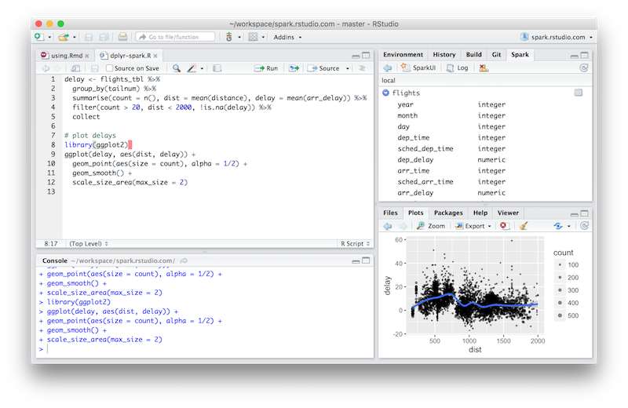
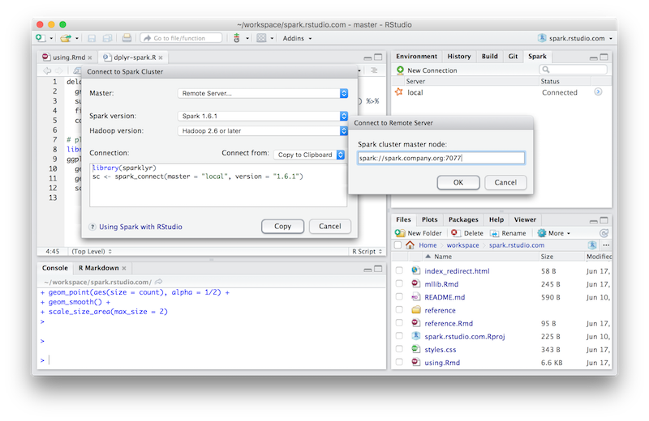
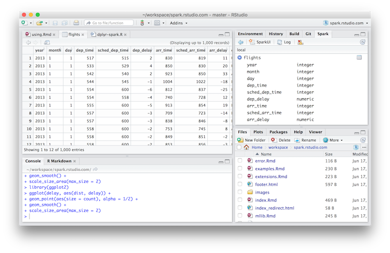

```{r setup, include=FALSE}
knitr::opts_chunk$set(eval = FALSE)
```


<!--
{#ide-screenshots .pull-left}
-->

<div class="lead">

- Connect to [Spark](http://spark.apache.org/) from R --- sparklyr implements a complete [dplyr](https://github.com/hadley/dplyr) backend.
- Filter and aggregate Spark datasets then bring them into R for analysis and visuzliation.
- Leverage Spark's [MLlib](http://spark.apache.org/docs/latest/mllib-guide.html) (machine learning library) for distributed machine learning from R.
- API for creating extensions that call the full Spark API and/or Spark packages. 
- Tight integration with RStudio IDE (managing connections, viewing datasets, etc.)

</div>

## Installation

Installation of sparklyr currently depends on the development versions of a few other packages so requires a few steps. We'll soon publish sparklyr to CRAN which will simplify installation considerably.

```{r, eval=FALSE}
# first install the development version of devtools
install.packages("devtools")
library(devtools)
install_github("hadley/devtools") 
reload(devtools::inst("devtools")) 

# install sparklyr using devtools
install_github("rstudio/sparklyr")
```

If you use the RStudio IDE, you should also download the latest [preview release](https://www.rstudio.com/products/rstudio/download/preview/) of the IDE which includes several enhancements for interacting with Spark (see the [RStudio IDE section](#rstudio-ide) below for more details).

## Connecting to Spark

If you're just getting started with Spark, sparklyr provides a way to run Spark on your local machine; in this mode, you don't need any additional servers or infrastructure. Alternatively, you can use sparklyr within a Spark cluster.

Below, you can find how to connect to either a local Spark instance or use sparklyr within a cluster. If you're using the RStudio IDE, you can click "New Connection" in the **Spark** pane and have it produce this code for you.

<ul class="nav nav-tabs">
  <li class="active"><a data-toggle="tab" href="#local">Local</a></li>
  <li><a data-toggle="tab" href="#cluster">Cluster</a></li>
</ul>
<div class="tab-content outlined-tab-content">
<div id="local" class="tab-pane fade in active">

To run in local mode you'll first need to install a local version of Spark. You can do this via the [install_spark](reference/sparklyr/latest/install_spark.html) function:

```{r}
library(sparklyr)
install_spark(version = "1.6.1")
```

You can connect to this local version of Spark by passing `"master = local"` to the [spark_connect](reference/sparklyr/latest/spark_connect.html) function:

```{r, eval=FALSE}
sc <- spark_connect(master = "local")
```
</div>
<div id="cluster" class="tab-pane fade">

To use sparklyr within a Spark cluster you should run [RStudio Server](https://www.rstudio.com/products/rstudio/) or an SSH session either directly on one of the cluster nodes or on a machine close to the cluster that has a Spark configuration identical to that of the cluster nodes.

In cluster mode sparklyr will locate the version of Spark to use via the `SPARK_HOME` environment variable, so you should be sure that this variable is correctly defined on your server before attempting a connection.

To connect, pass the address of the master node to [spark_connect](reference/sparklyr/latest/spark_connect.html), for example:

```{r}
library(sparklyr)
sc <- spark_connect(master = "spark://spark.example.com:7077")
```

Where `spark.example.com` is the address of your Spark cluster's master node, and `7077` is the port on which Spark is listening. If you are running directly on the master node then the address of the master would be typically be  `"spark://local:7077"`.

</div>
</div>

You can view the Spark web UI via the [spark_web](reference/sparklyr/latest/spark_web.html) function, and view the Spark log via the [spark_log](reference/sparklyr/latest/spark_log.html) function:

```{r}
spark_web(sc)
spark_log(sc)
```

You can disconnect from Spark using the [spark_disconnect](reference/sparklyr/latest/spark_disconnect.html) function:

```{r}
spark_disconnect(sc)
```


For additional information on deployment and configuration of Spark and sparklyr see the [Deployment](deployment.html) section.

## Spark DataFrames

sparklyr can operate on data from a variety of Spark sources. Effectively, you're only limited to the types of data that you can read into Spark.

### R data.frames & dplyr Tables

The simplest way to get started is to copy an existing data.frame or dplyr table into your Spark cluster. This will create a Spark DataFrame stored in your Spark cluster. Assuming you already have a connection to a Spark cluster (as shown above) in the `sc` variable:

```{r, eval=FALSE}
iris_tbl <- copy_to(sc, iris, "irisspark")
```

will copy the `iris` dataset to a Spark DataFrame named `irisspark`. A reference to that DataFrame will be stored in the `iris_tbl` variable in R. If you'd rather reference a DataFrame that already exists on a spark cluster, you can simply create a reference to it using the `tbl()` function. 

```{r, eval=FALSE}
iris_tbl2 <- tbl(sc, "irisspark")
```

Both `iris_tbl` and `iris_tbl2` reference the exact same Spark DataFrame, and you can treat them like any other dplyr table.

```{r, eval=FALSE}
iris_tbl %>% 
  filter(Petal_Length < 1.2) %>% 
  collect()
```
```
Source: local data frame [2 x 5]

  Sepal_Length Sepal_Width Petal_Length Petal_Width Species
         <dbl>       <dbl>        <dbl>       <dbl>   <chr>
1          4.3         3.0          1.1         0.1  setosa
2          4.6         3.6          1.0         0.2  setosa
```

### Reading Data

sparklyr provides the packages necessary to be able to read from CSV, JSON, and [Parquet](http://parquet.apache.org/) formats. (Note that the JSON format used in Spark is more particular about newlines than most JSON parsers.) 

Regardless of the format of your data, Spark supports reading data from a variety of different data sources. These include data stored on HDFS, Amazon S3, or local files available to the Spark worker nodes. By default, sparklyr provides the necessary Spark packages to enable you to work with HDFS, S3, or local files; you can add additional packages to your Spark context if you need to support other sources, as described [here](extensions.html#dependencies).

To load data from S3, you'll need to make sure that your `AWS_ACCESS_KEY_ID` and `AWS_SECRET_ACCESS_KEY` are both available. Then you can run a command like:

```{r, eval=FALSE}
my_tbl <- spark_read_csv(
  sc, 
  "tblname", 
  "s3n://bucket-name/path/file-name.csv")
```

Loading data from HDFS is just as simple:

```{r, eval=FALSE}
iris_tbl <- spark_read_json(
  sc, 
  "iris", 
  "hdfs://hdfs.company.org:9000/hdfs-path/iris.json")
```

You can also read from local files, but it's important to realize that the files are "local" *relative to the Spark worker nodes*. This means that a local file on the machine where you're running R, or even on your Spark master node will not be available.

```{r, eval=FALSE}
iris_tbl <- spark_read_csv(sc, "iris", "file:///iris.csv")
```

### Writing Data

It is often useful to save the results of your analysis or the tables that you have generated on your Spark cluster into persistent storage. The best option in many scenarios is to right the table out to a [Parquet](http://parquet.apache.org/) file.

```{r, eval=FALSE}
spark_write_parquet(
  tbl, 
  "hdfs://hdfs.company.org:9000/hdfs-path/data")
```

This will write the Spark DataFrame referenced by the `tbl` R variable to the given HDFS path. Of course, you could use any of the other persistence media discussed above (local file, S3, etc.).

<!-- TODO: Hive -->

## Data Manipulation with dplyr

sparklyr implements a complete [dplyr](https://github.com/hadley/dplyr) back-end for data hosted in Spark. If you have a dataset available in Spark, you can interact with it just as you would any other dplyr data source.

```{r, eval=FALSE}
iris_tbl <- tbl(db, "iris")

iris_tbl %>% 
  filter(Sepal_Length > 5) %>% 
  group_by(Species) %>% 
  summarize(
    plength = mean(Petal_Length), 
    pwidth=mean(Petal_Width)) %>% 
  collect()
```
```
Source: local data frame [3 x 3]

     Species  plength    pwidth
       <chr>    <dbl>     <dbl>
1 versicolor 4.317021 1.3468085
2     setosa 1.509091 0.2772727
3  virginica 5.573469 2.0326531
```

Alternatively, you can `collect()` the results of your dplyr sequence into your local R session and interact with it just like you do any other data. For example:

```{r, eval=FALSE}
delay <- tbl(sc, "flights") %>% 
  group_by(tailnum) %>%
  summarise(count = n(),  dist = mean(distance), 
            delay = mean(arr_delay)) %>%
  filter(count > 20,  dist < 2000,  !is.na(delay)) %>%
  collect

# plot delays
library(ggplot2)
ggplot(delay, aes(dist, delay)) +
  geom_point(aes(size = count), alpha = 1/2) +
  geom_smooth() +
  scale_size_area(max_size = 2)
```


For more advanced usage, refer to the [dplyr section](dplyr.html).

## Machine Learning

Spark includes a Machine Learning library that enables you to distribute specific machine learning operations across your Spark cluster. In order to perform analysis on an object using some R code, you would need to load your data into the R session. These Spark machine learning functions offer an alternative in which you can perform the analysis on data that lives in Spark and may be too big to load onto your local machine. These machine learning functions represent only a subset of the analytical functions available in the R ecosystem, but they can be useful for basic analysis on large data sets nonetheless. 

Here's a simple example of such analysis using the flights data available in the `nycflights13` package. In reality, there are only 336k rows in this dataset which would easily fit into memory on most machines, but you can see the principles here which would apply to a much larger dataset.

We'll perform a linear regression between the `distance` travelled in a flight and the duration of the flight (`air_time`) using the `ml_linear_regression()` function in sparklyr. Note that we never actually load the dataset into memory on our local R session in these commands; the data and all analysis lives in Spark.

```{r, eval=FALSE}
# Fit a model on ALL the data -- which may be too big to download or analyze locally
model <- flights_tbl %>%
  filter(!is.na(distance), !is.na(air_time)) %>% 
  select(distance, air_time) %>%
  ml_linear_regression(response = "air_time", features = c("distance"))
```

Now that we have a model, let's download a small portion of the dataset (just 250 rows) and plot them against the linear regression we performed on the whole dataset.

```{r, eval=FALSE}
flights_tbl %>%
  filter(!is.na(distance),  !is.na(air_time)) %>% 
  select(distance, air_time) %>%
  sample_n(250) %>% 
  collect %>%
  ggplot(aes(distance, air_time)) +
  geom_point(aes(distance, air_time), 
             size = 1,  alpha = 0.4) +
  geom_abline(aes(
    slope = coef(model)[["distance"]],
    intercept = coef(model)[["(Intercept)"]],
    color = "red")) +
  theme(legend.position="none")
```


Another example is the `ml_random_forest()` function in sparklyr which constructs a random forest on the specified data hosted in Spark. Again, this example does not load the data into R nor does it download the data to your machine; the data and all analysis happens on the Spark cluster.

We'll construct a random forest to predict the departure delay given the day of the year.

```{r, eval=FALSE}
mForest <- flights_tbl %>%
  filter(!is.na(dep_delay)) %>% 
  ml_random_forest(
    response = "dep_delay",
    features = c("month", "day"),
    max.bins = 32L,
    max.depth = 5L,
    num.trees = 20L
  )
mPredict <- predict(mForest, flights_tbl)
```

You would now have predictions for how long a flight's departure would be delayed for each day of the year.

## RStudio IDE

The latest [preview release](https://www.rstudio.com/products/rstudio/download/preview/) of the IDE includes support for interacting with Spark data sources. Once you've installed the sparklyr package, you should find a new tab entitled "Spark" in the upper right pane of the IDE. In this tab, you can create a new connection to a Spark cluster (local or cluster), view the tables available in a Spark cluster to which you're connected, or even preview the first 1,000 rows of a table in Spark.




