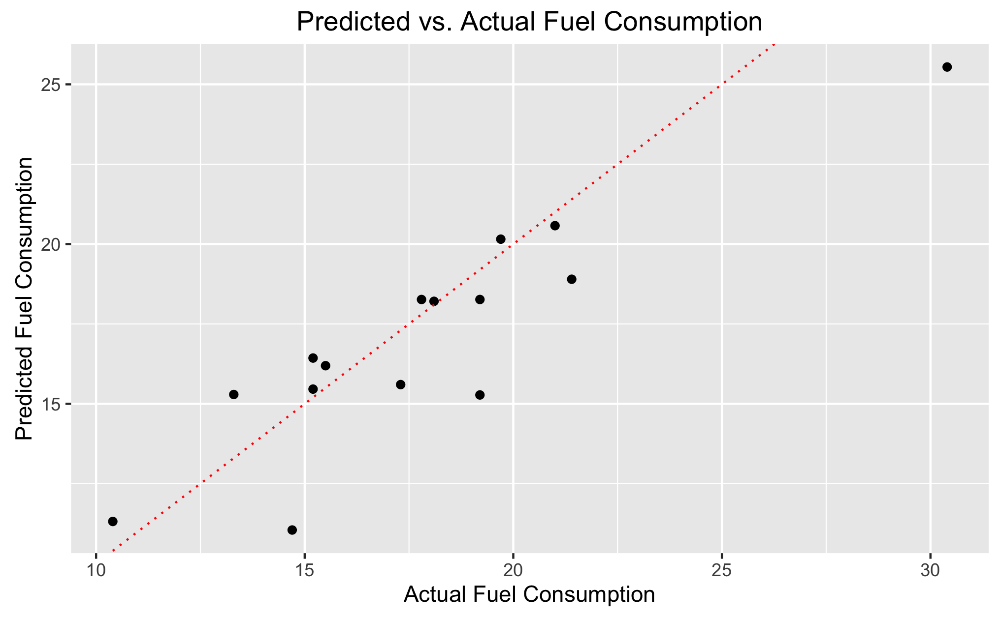
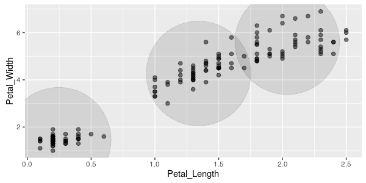
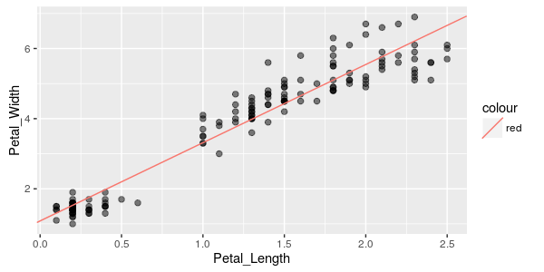

```{r setup, include=FALSE}
knitr::opts_chunk$set(eval = FALSE)
```

## Overview

You can orchestrate machine learning algorithms in a Spark cluster via the [MLlib](http://spark.apache.org/docs/latest/mllib-guide.html) functions in **sparklyr**. These functions connect to a set of high-level APIs built on top of DataFrames that help you create and tune machine learning workflows, and easily build and tune your own machine learning pipelines within R.

**sparklyr** provides three families of functions that you might use within a machine learning pipeline within R:

- Machine learning algorithms for analyzing data (`ml_*`)
- Feature transformers for manipulating individual features (`ft_*`)
- Functions for manipulating Spark DataFrames (`sdf_*`)

A typical machine learning pipeline with **sparklyr** might be composed of the following stages. To fit a model, you might need to:

1. Perform SQL queries through the **sparklyr** [dplyr](dplyr.html) interface,
2. Use the `sdf_*` and `ft_*` family of functions to generate new columns, or partition your data set,
3. Choose an appropriate machine learning algorithm from the `ml_*` family of functions to model your data,
4. Inspect the quality of your model fit, and use it to make predictions with new data.

Let's walk through a motivating example to see how these pieces might come together. We'll use [ml_linear_regression](reference/sparklyr/latest/ml_linear_regression.html) to fit a linear regression model. Using the built-in `mtcars` dataset, we'll try to predict a car's fuel consumption (`mpg`) based on its weight (`wt`), and the number of cylinders the engine contains (`cyl`).

First, we will initialize a local Spark connection, and copy the `mtcars` dataset into Spark.

```{r}
library(sparklyr)
library(dplyr)
sc <- spark_connect("local", version = "1.6.1")
mtcars_tbl <- copy_to(sc, mtcars, "mtcars", overwrite = TRUE)
```

Now, let's perform some simple transformations -- we'll

1. Remove all cars with horsepower less than 100,
2. Produce a column encoding whether a car has 8 cylinders or not,
3. Partition the data into separate training and test data sets,
4. Fit a model to our training data set,
5. Evaluate our predictive performance on our test dataset.

```{r}
# transform our data set, and then partition into 'training', 'test'
partitions <- mtcars_tbl %>%
  filter(hp >= 100) %>%
  mutate(cyl8 = cyl == 8) %>%
  sdf_partition(training = 0.5, test = 0.5, seed = 1099)

# fit a linear mdoel to the training dataset
fit <- partitions$training %>%
  ml_linear_regression(response = "mpg", features = c("wt", "cyl"))
print(fit)
```
```
Call:
mpg ~ wt + cyl

Coefficients:
(Intercept)          wt         cyl 
  33.499452   -2.818463   -0.923187 
```

For linear regression models produced by Spark, we can use `summary()` to learn a bit more about the quality of our fit, and the statistical significance of each of our predictors.

```{r, eval=FALSE}
summary(fit)
```
```
Call:
mpg ~ wt + cyl

Residuals:
   Min     1Q Median     3Q    Max 
-1.752 -1.134 -0.499  1.296  2.282 

Coefficients:
            Estimate Std. Error t value  Pr(>|t|)    
(Intercept) 33.49945    3.62256  9.2475 0.0002485 ***
wt          -2.81846    0.96619 -2.9171 0.0331257 *  
cyl         -0.92319    0.54639 -1.6896 0.1518998    
---
Signif. codes:  0 '***' 0.001 '**' 0.01 '*' 0.05 '.' 0.1 ' ' 1

R-Squared: 0.8274
Root Mean Squared Error: 1.422
```

The `summary()` suggests that our model is a fairly good fit, and that both a cars weight, as well as the number of cylinders in its engine, will be powerful predictors of its average fuel consumption. (The model suggests that, on average, heavier cars consume more fuel.)

Let's use our Spark model fit to predict the average fuel consumption on our test data set, and compare the predicted response with the true measured fuel consumption. We'll build a simple ggplot2 plot that will allow us to inspect the quality of our predictions.

```{r}
library(ggplot2)

# compute predicted values on our test dataset
predicted <- predict(fit, newdata = partitions$test)

# extract the true 'mpg' values from our test dataset
actual <- partitions$test %>%
  select(mpg) %>%
  collect() %>%
  `[[`("mpg")

# produce a data.frame housing our predicted + actual 'mpg' values
data <- data.frame(
  predicted = predicted,
  actual    = actual
)

# plot predicted vs. actual values
ggplot(data, aes(x = actual, y = predicted)) +
  geom_abline(lty = "dashed", col = "red") +
  geom_point() +
  theme(plot.title = element_text(hjust = 0.5)) +
  coord_fixed(ratio = 1) +
  labs(
    x = "Actual Fuel Consumption",
    y = "Predicted Fuel Consumption",
    title = "Predicted vs. Actual Fuel Consumption"
  )
```



Although simple, our model appears to do a fairly good job of predicting a car's average fuel consumption.

As you can see, we can easily and effectively combine dplyr data transformation pipelines with the MLlib modelling interface provided by Spark.

## Algorithms

Spark's machine learning library can be accessed from **sparklyr** through the `ml_*` set of functions:

| Function | Description  |
|----------------------------|---------------------------------------------|
| [`ml_kmeans`](reference/sparklyr/latest/ml_kmeans.html) | K-Means Clustering |
| [`ml_linear_regression`](reference/sparklyr/latest/ml_linear_regression.html) | Linear Regression |
| [`ml_logistic_regression`](reference/sparklyr/latest/ml_logistic_regression.html) | Logistic Regression |
| [`ml_survival_regression`](reference/sparklyr/latest/ml_survival_regression.html) | Survival Regression |
| [`ml_decision_tree`](reference/sparklyr/latest/ml_decision_tree.html) | Decision Trees |
| [`ml_random_forest`](reference/sparklyr/latest/ml_random_forest.html) | Random Forests |
| [`ml_gradient_boosted_trees`](reference/sparklyr/latest/ml_gradient_boosted_trees.html) | Gradient-Boosted Trees |
| [`ml_pca`](reference/sparklyr/latest/ml_pca.html) | Principal Components Analysis |
| [`ml_naive_bayes`](reference/sparklyr/latest/ml_naive_bayes.html) | Naive-Bayes |
| [`ml_multilayer_perceptron`](reference/sparklyr/latest/ml_multilayer_perceptron.html) |  Multilayer Perceptron |
| [`ml_lda`](reference/sparklyr/latest/ml_lda.html) | Latent Dirichlet Allocation |
| [`ml_one_vs_rest`](reference/sparklyr/latest/ml_lda.html) | One vs Rest |

## Transformers

A model is often fit not on a dataset as-is, but instead on some transformation of that dataset. Spark provides [feature transformers](http://spark.apache.org/docs/latest/ml-features.html), faciliating many common transformations of data within in a Spark DataFrame, and **sparklyr** exposes these within the `ft_*` family of functions. These routines generally take one or more input columns, and generate a new output column formed as a transformation of those columns.

| Function | Description  |
|----------------------------|---------------------------------------------|
| [`ft_binarizer`](reference/sparklyr/latest/ft_binarizer.html) | Threshold numerical features to binary (0/1) feature  |
| [`ft_bucketizer`](reference/sparklyr/latest/ft_bucketizer.html) | Bucketizer transforms a column of continuous features to a column of feature buckets |
| [`ft_discrete_cosine_transform`](reference/sparklyr/latest/ft_discrete_cosine_transform.html) | Transforms a length NN real-valued sequence in the time domain into another length NN real-valued sequence in the frequency domain |
| [`ft_elementwise_product`](reference/sparklyr/latest/ft_elementwise_product.html) | Multiplies each input vector by a provided weight vector, using element-wise multiplication. |
| [`ft_index_to_string`](reference/sparklyr/latest/ft_index_to_string.html) | Maps a column of label indices back to a column containing the original labels as strings |
| [`ft_quantile_discretizer`](reference/sparklyr/latest/ft_quantile_discretizer.html) | Takes a column with continuous features and outputs a column with binned categorical features |
| [`ft_sql_transformer`](reference/sparklyr/latest/ft_sql_transformer.html) | Implements the transformations which are defined by a SQL statement |
| [`ft_string_indexer`](reference/sparklyr/latest/ft_string_indexer.html) | Encodes a string column of labels to a column of label indices |
| [`ft_vector_assembler`](reference/sparklyr/latest/ft_vector_assembler.html) | Combines a given list of columns into a single vector column |

A simple example is the binarizer, which transforms a feature into 1's and 0's based on a threshold. Let's create a new column in our `mtcars` data set, `mpg20`, that encodes whether a car achieves more than 20 miles per gallon in fuel efficiency.

```{r}
ft_binarizer(
  mtcars_tbl,
  input_col = "mpg",
  output_col = "mpg20",
  threshold = 20
)
```
```
Source:   query [?? x 12]
Database: spark connection master=local app=sparklyr local=TRUE

     mpg   cyl  disp    hp  drat    wt  qsec    vs    am  gear  carb mpg20
   <dbl> <dbl> <dbl> <dbl> <dbl> <dbl> <dbl> <dbl> <dbl> <dbl> <dbl> <dbl>
1   21.0     6 160.0   110  3.90 2.620 16.46     0     1     4     4     1
2   21.0     6 160.0   110  3.90 2.875 17.02     0     1     4     4     1
3   22.8     4 108.0    93  3.85 2.320 18.61     1     1     4     1     1
4   21.4     6 258.0   110  3.08 3.215 19.44     1     0     3     1     1
5   18.7     8 360.0   175  3.15 3.440 17.02     0     0     3     2     0
6   18.1     6 225.0   105  2.76 3.460 20.22     1     0     3     1     0
7   14.3     8 360.0   245  3.21 3.570 15.84     0     0     3     4     0
8   24.4     4 146.7    62  3.69 3.190 20.00     1     0     4     2     1
9   22.8     4 140.8    95  3.92 3.150 22.90     1     0     4     2     1
10  19.2     6 167.6   123  3.92 3.440 18.30     1     0     4     4     0
# ... with more rows
```

[sdf_mutate](reference/sparklyr/latest/sdf_mutate.html) is provided as a helper function, to allow you to use feature transformers within a pipeline. For example, the previous code snippet could have been written as:

```{r, eval=FALSE}
mtcars_tbl %>%
  sdf_mutate(cyl8 = ft_binarizer(cyl, threshold = 20))
```
```
Source:   query [?? x 12]
Database: spark connection master=local app=sparklyr local=TRUE

     mpg   cyl  disp    hp  drat  qsec    vs    am  gear  carb    wt  cyl8
   <dbl> <dbl> <dbl> <dbl> <dbl> <dbl> <dbl> <dbl> <dbl> <dbl> <dbl> <dbl>
1   21.0     6 160.0   110  3.90 16.46     0     1     4     4  2620     0
2   21.0     6 160.0   110  3.90 17.02     0     1     4     4  2875     0
3   22.8     4 108.0    93  3.85 18.61     1     1     4     1  2320     0
4   21.4     6 258.0   110  3.08 19.44     1     0     3     1  3215     0
5   18.7     8 360.0   175  3.15 17.02     0     0     3     2  3440     1
6   18.1     6 225.0   105  2.76 20.22     1     0     3     1  3460     0
7   14.3     8 360.0   245  3.21 15.84     0     0     3     4  3570     1
8   24.4     4 146.7    62  3.69 20.00     1     0     4     2  3190     0
9   22.8     4 140.8    95  3.92 22.90     1     0     4     2  3150     0
10  19.2     6 167.6   123  3.92 18.30     1     0     4     4  3440     0
# ... with more rows
```

## Examples

We will use the `iris` data set to examine a handful of learning altogithms and transformers. The iris data set measures attributes for 150 flowers in 3 different species of iris.

```{r, eval=FALSE}
library(sparklyr)
library(ggplot2)
library(dplyr)
sc <- spark_connect("local", version = "1.6.1")
iris_tbl <- copy_to(sc, iris, "iris", overwrite = TRUE)
iris_tbl
```
```
Source:   query [?? x 5]
Database: spark connection master=local app=sparklyr local=TRUE

   Sepal_Length Sepal_Width Petal_Length Petal_Width Species
          <dbl>       <dbl>        <dbl>       <dbl>   <chr>
1           5.1         3.5          1.4         0.2  setosa
2           4.9         3.0          1.4         0.2  setosa
3           4.7         3.2          1.3         0.2  setosa
4           4.6         3.1          1.5         0.2  setosa
5           5.0         3.6          1.4         0.2  setosa
6           5.4         3.9          1.7         0.4  setosa
7           4.6         3.4          1.4         0.3  setosa
8           5.0         3.4          1.5         0.2  setosa
9           4.4         2.9          1.4         0.2  setosa
10          4.9         3.1          1.5         0.1  setosa
# ... with more rows
```

### KMeans 

```{r}
model <- iris_tbl %>%
  select(Petal_Width, Petal_Length) %>%
  ml_kmeans(centers = 3)

iris_tbl %>%
  select(Petal_Width, Petal_Length) %>%
  collect %>%
  ggplot(aes(Petal_Length, Petal_Width)) +
    geom_point(data = model$centers, aes(Petal_Width, Petal_Length), size = 60, alpha = 0.1) +
    geom_point(aes(Petal_Width, Petal_Length), size = 2, alpha = 0.5)
```



### Linear Regression

```{r}
model <- iris_tbl %>%
  select(Petal_Width, Petal_Length) %>%
  ml_linear_regression(response = "Petal_Length", features = c("Petal_Width"))

iris_tbl %>%
  select(Petal_Width, Petal_Length) %>%
  collect %>%
  ggplot(aes(Petal_Length, Petal_Width)) +
    geom_point(aes(Petal_Width, Petal_Length), size = 2, alpha = 0.5) +
    geom_abline(aes(slope = coef(model)[["Petal_Width"]],
                    intercept = coef(model)[["(Intercept)"]]),
                color = "red")
```



### Logistic Regression

```{r}
# Prepare beaver dataset
beaver <- beaver2
beaver$activ <- factor(beaver$activ, labels = c("Non-Active", "Active"))
copy_to(sc, beaver, "beaver")
beaver_tbl <- tbl(sc, "beaver")

model <- beaver_tbl %>%
  mutate(response = as.numeric(activ == "Active")) %>%
  ml_logistic_regression(response = "response", features = "temp")

print(model)
```
```
Source:   query [?? x 4]
Database: spark connection master=local app=sparklyr local=TRUE

     day  time  temp      activ
   <dbl> <dbl> <dbl>      <chr>
1    307   930 36.58 Non-Active
2    307   940 36.73 Non-Active
3    307   950 36.93 Non-Active
4    307  1000 37.15 Non-Active
5    307  1010 37.23 Non-Active
6    307  1020 37.24 Non-Active
7    307  1030 37.24 Non-Active
8    307  1040 36.90 Non-Active
9    307  1050 36.95 Non-Active
10   307  1100 36.89 Non-Active
# ... with more rows
Call: response ~ temp

Coefficients:
(Intercept)        temp 
 -550.52331    14.69184 
```

### Partitioning 

```{r}
partitions <- tbl(sc, "iris") %>%
  sdf_partition(training = 0.75, test = 0.25, seed = 1099)

fit <- partitions$training %>%
  ml_linear_regression(response = "Petal_Length", features = c("Petal_Width"))

predict(fit, partitions$test)
```
```
 [1] 1.744571 1.521752 1.521752 1.521752 1.298933 1.521752 2.413029 1.521752 1.967390 1.521752 1.521752 1.521752 1.521752 3.527124 3.972763 3.972763 3.749944 5.309678 4.418401 5.086858 4.641220 4.418401 4.641220 4.195582 5.086858 3.972763 5.309678 5.086858 3.972763 5.532497 5.532497 3.972763 4.195582 6.423773 6.200954 4.641220 5.086858
```

### PCA 

```{r}
model <- tbl(sc, "iris") %>%
  select(-Species) %>%
  ml_pca()
print(model)
```
```
Explained variance:
[not available in this version of Spark]

Rotation:
                     PC1         PC2         PC3        PC4
Sepal_Length -0.36138659 -0.65658877  0.58202985  0.3154872
Sepal_Width   0.08452251 -0.73016143 -0.59791083 -0.3197231
Petal_Length -0.85667061  0.17337266 -0.07623608 -0.4798390
Petal_Width  -0.35828920  0.07548102 -0.54583143  0.7536574
```

### Random Forest

```{r}
mForest <- iris_tbl %>%
  ml_random_forest(
    response = "Species",
    features = c("Petal_Length", "Petal_Width"),
    max.bins = 32L,
    max.depth = 5L,
    num.trees = 20L
  )
mPredict <- predict(mForest, iris_tbl)
iris_fit <- iris_tbl %>%
  select(Species) %>%
  collect %>%
  mutate(fit = mPredict)
table(iris_fit)
```
```
            fit
Species      setosa versicolor virginica
  setosa         50          0         0
  versicolor      0         49         1
  virginica       0          0        50
```

