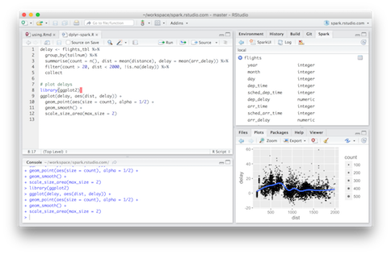
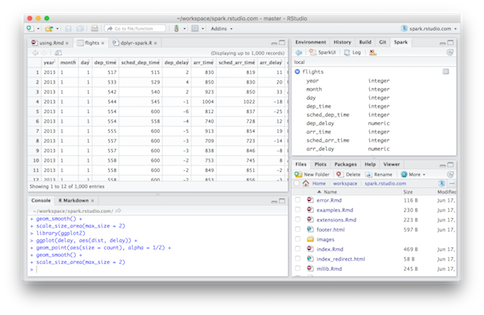
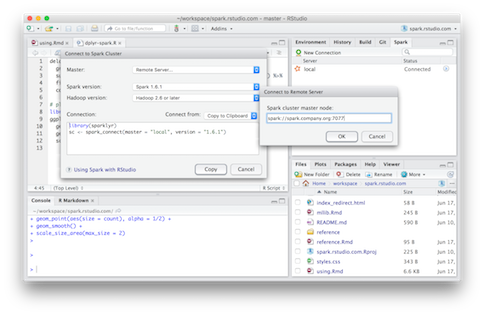

<script type="text/javascript">
$(document).ready(function() {
  // Rotate the IDE screenshots
  
  // How many images do we have
  var count = $('#ide-screenshots img').length;
  
  var counter = 0;
  
  // Hide the current image and show the next one.
  function rotateImg(){
    $('#ide-screenshots img').eq((counter-1) % count).fadeOut(500, function(){
      $('#ide-screenshots img').eq(counter % count).fadeIn(500);
      counter++;
    });
  }
  
  // Hide all images
  $('#ide-screenshots img').hide();
  
  // Bring in the first image now
  rotateImg();
  
  // Schedule the images to rotate every 5s
  setInterval(rotateImg, 5000);
})
</script>

Apache Spark is a tool that allows for distributed data storage and massively parallel computation on that data. Spark has increased in popularity over recent years as it enables relatively low-latency access to massive datasets and simultaneously provides libraries that can operate on that data in parallel on large clusters.

sparklyr is a package that allows you to interact with data stored in Spark from a local R session. It implements a complete [dplyr](https://github.com/hadley/dplyr) backend for Spark which enables users to pull sets of data out of Spark and compute on it using all of the R libraries with which they're already familiar. dplyr attempts to perform as much of the data transformation and filtering remotely as possible, meaning that massive Spark datasets can be filtered, joined, and aggregated but only the results of all that work will be delivered to your local R session.

sparklyr also exposes many of Spark's machine learning functions which allow you to perform some analytical functions in a distributed manner in Spark. These can even be paired with the feature transformation functions, resulting in R code that can drive even more complex analysis being performed in parallel across a Spark cluster.

## Installation

sparklyr currently requires a version of devtools more recent than the one on CRAN. Assuming you already have an older version available, you can run the following commands to update to the latest version.

```{r, eval=FALSE}
library(devtools)
# Install the latest version
install_github("hadley/devtools") 
# Reload devtools to use the latest
reload(devtools::inst("devtools")) 

# Install sparklyr
devtools::install_github("rstudio/sparklyr")
library(sparklyr)
```

Now that you have the sparklyr package installed, you need to install the Spark libraries. You can do so using the following command: 

```{r, eval=FALSE}
spark_install(version="1.6.1", hadoop_version="2.6")
```

You can customize the versions of Spark or Hadoop to your liking. For more information on installation or to see examples of more advanced deployments, read the [Deployment section](deployment.html).

If you use the RStudio IDE, you should download the latest [preview release](https://www.rstudio.com/products/rstudio/download/preview/) of the IDE which includes support for interacting with Spark data sources; see the [RStudio IDE section](#rstudio-ide) below for more details.

## Connecting to Spark

If you're just getting started with Spark, sparklyr provides a way to run a Spark cluster on your local machine; in this mode, you don't need any additional servers or infrastructure. Alternatively, you can use sparklyr to connect to an existing cluster, or even have it provision a remote cluster for you on Amazon EC2 (see the EC2 section in [Deployment](deployment.html)).

Below, you can find how to connect to either a local or a remote cluster. If you're using the RStudio IDE, you can click "New Connection" in the `Spark` tab and have it produce this code for you.

<ul class="nav nav-tabs">
  <li class="active"><a data-toggle="tab" href="#local">Local</a></li>
  <li><a data-toggle="tab" href="#remote">Remote</a></li>
</ul>
<div class="tab-content outlined-tab-content">
<div id="local" class="tab-pane fade in active">

If you're running a local Spark cluster, you can run whatever version of Spark you want with any available version of the Hadoop libraries so long as those versions have been installed using `spark_install()` previously.

```{r, eval=FALSE}
sc <- spark_connect("local", version="1.6.1")
```
</div>
<div id="remote" class="tab-pane fade">

If you're connecting to a remote cluster, it's important to make sure that the your targeted Spark version and the version of the Hadoop libraries that you use align with what the remote cluster is using. Even though you're connecting to a remote Spark instance, you'll still need to have those versions available on your local machine; you can download them using `spark_install()`.

```{r, eval=FALSE}
sc <- spark_connect("spark://spark.server.org:7077", 
                    version = "1.6.1", 
                    hadoop_version = "2.4")
```

where `spark.server.org` is the address of your Spark cluster's master node, and `7077` is the port on which Spark is listening.

</div>
</div>

You now have a connection to a Spark cluster. If you have a more advanced configuration of need more guidance, see the [Deployment section](deployment.html).

<!-- TODO: Brief discussion/illustration of architecture? -->

## Spark DataFrames

sparklyr can operate on data from a variety of Spark sources. Effectively, you're only limited to the types of data that you can read into Spark.

### R data.frames & dplyr Tables

The simplest way to get started is to copy an existing data.frame or dplyr table into your Spark cluster. This will create a Spark DataFrame stored in your Spark cluster. Assuming you already have a connection to a Spark cluster (as shown above) in the `sc` variable:

```{r, eval=FALSE}
iris_tbl <- copy_to(sc, iris, "irisspark")
```

will copy the `iris` dataset to a Spark DataFrame named `irisspark`. A reference to that DataFrame will be stored in the `iris_tbl` variable in R. If you'd rather reference a DataFrame that already exists on a spark cluster, you can simply create a reference to it using the `tbl()` function. 

```{r, eval=FALSE}
iris_tbl2 <- tbl(sc, "irisspark")
```

Both `iris_tbl` and `iris_tbl2` reference the exact same Spark DataFrame, and you can treat them like any other dplyr table.

```{r, eval=FALSE}
iris_tbl %>% 
  filter(Petal_Length < 1.2) %>% 
  collect()
```
```
Source: local data frame [2 x 5]

  Sepal_Length Sepal_Width Petal_Length Petal_Width Species
         <dbl>       <dbl>        <dbl>       <dbl>   <chr>
1          4.3         3.0          1.1         0.1  setosa
2          4.6         3.6          1.0         0.2  setosa
```

### Reading Data

sparklyr provides the packages necessary to be able to read from CSV, JSON, and [Parquet](http://parquet.apache.org/) formats. (Note that the JSON format used in Spark is more particular about newlines than most JSON parsers.) 

Regardless of the format of your data, Spark supports reading data from a variety of different data sources. These include data stored on HDFS, Amazon S3, or local files available to the Spark worker nodes. By default, sparklyr provides the necessary Spark packages to enable you to work with HDFS, S3, or local files; you can add additional packages to your Spark context if you need to support other sources.

To load data from S3, you'll need to make sure that your `AWS_ACCESS_KEY_ID` and `AWS_SECRET_ACCESS_KEY` are both available. Then you can run a command like:

```{r, eval=FALSE}
my_tbl <- spark_read_csv(
  sc, 
  "tblname", 
  "s3n://bucket-name/path/file-name.csv")
```

Loading data from HDFS is just as simple:

```{r, eval=FALSE}
iris_tbl <- spark_read_json(
  sc, 
  "iris", 
  "hdfs://hdfs.company.org:9000/hdfs-path/iris.json")
```

You can also read from local files, but it's important to realize that the files are "local" *relative to the Spark worker nodes*. This means that a local file on the machine where you're running R, or even on your Spark master node will not be available.

```{r, eval=FALSE}
iris_tbl <- spark_read_csv(sc, "iris", "file:///iris.csv")
```

### Writing Data

It is often useful to save the results of your analysis or the tables that you have generated on your Spark cluster into persistent storage. The best option in many scenarios is to right the table out to a [Parquet](http://parquet.apache.org/) file.

```{r, eval=FALSE}
spark_write_parquet(
  tbl, 
  "hdfs://hdfs.company.org:9000/hdfs-path/data")
```

This will write the Spark DataFrame referenced by the `tbl` R variable to the given HDFS path. Of course, you could use any of the other persistence media discussed above (local file, S3, etc.).

<!-- TODO: Hive -->

## Data Manipulation with dplyr

sparklyr implements a complete [dplyr](https://github.com/hadley/dplyr) back-end for data hosted in Spark. If you have a dataset available in Spark, you can interact with it just as you would any other dplyr data source.

```{r, eval=FALSE}
iris_tbl <- tbl(db, "iris")

iris_tbl %>% 
  filter(Sepal_Length > 5) %>% 
  group_by(Species) %>% 
  summarize(
    plength = mean(Petal_Length), 
    pwidth=mean(Petal_Width)) %>% 
  collect()
```
```
Source: local data frame [3 x 3]

     Species  plength    pwidth
       <chr>    <dbl>     <dbl>
1 versicolor 4.317021 1.3468085
2     setosa 1.509091 0.2772727
3  virginica 5.573469 2.0326531
```

Alternatively, you can `collect()` the results of your dplyr sequence into your local R session and interact with it just like you do any other data. For example:

<div class="row">
<div class="col-md-7">
```{r, eval=FALSE}
delay <- tbl(sc, "flights") %>% 
  group_by(tailnum) %>%
  summarise(count = n(), 
            dist = mean(distance), 
            delay = mean(arr_delay)) %>%
  filter(count > 20, 
         dist < 2000, 
         !is.na(delay)) %>%
  collect

# plot delays
library(ggplot2)
ggplot(delay, aes(dist, delay)) +
  geom_point(aes(size = count), alpha = 1/2) +
  geom_smooth() +
  scale_size_area(max_size = 2)
```
</div>
<div class="col-md-5">

</div>
</div>

For more advanced usage, refer to the [dplyr section](dplyr.html).

## Machine Learning

Spark includes a Machine Learning library that enables you to distribute specific machine learning operations across your Spark cluster. In order to perform analysis on an object using some R code, you would need to load your data into the R session. These Spark machine learning functions offer an alternative in which you can perform the analysis on data that lives in Spark and may be too big to load onto your local machine. These machine learning functions represent only a subset of the analytical functions available in the R ecosystem, but they can be useful for basic analysis on large data sets nonetheless. 

Here's a simple example of such analysis using the flights data available in the `nycflights13` package. In reality, there are only 336k rows in this dataset which would easily fit into memory on most machines, but you can see the principles here which would apply to a much larger dataset.

We'll perform a linear regression between the `distance` travelled in a flight and the duration of the flight (`air_time`) using the `ml_linear_regression()` function in sparklyr. Note that we never actually load the dataset into memory on our local R session in these commands; the data and all analysis lives in Spark.

```{r, eval=FALSE}
# Fit a model on ALL the data -- which may be too big to download or analyze locally
model <- flights_tbl %>%
  filter(!is.na(distance), !is.na(air_time)) %>% 
  select(distance, air_time) %>%
  ml_linear_regression(response = "air_time", features = c("distance"))
```

Now that we have a model, let's download a small portion of the dataset (just 250 rows) and plot them against the linear regression we performed on the whole dataset.

<div class="row">
<div class="col-md-7">
```{r, eval=FALSE}
flights_tbl %>%
  filter(!is.na(distance), 
         !is.na(air_time)) %>% 
  select(distance, air_time) %>%
  sample_n(250) %>% 
  collect %>%
  ggplot(aes(distance, air_time)) +
  geom_point(aes(distance, air_time), 
             size = 1, 
             alpha = 0.4) +
  geom_abline(aes(
    slope = coef(model)[["distance"]],
    intercept = coef(model)[["(Intercept)"]],
    color = "red")) +
  theme(legend.position="none")
```
</div>
<div class="col-md-5">

</div>
</div>

Another example is the `ml_random_forest()` function in sparklyr which constructs a random forest on the specified data hosted in Spark. Again, this example does not load the data into R nor does it download the data to your machine; the data and all analysis happens on the Spark cluster.

We'll construct a random forest to predict the departure delay given the day of the year.

```{r, eval=FALSE}
mForest <- flights_tbl %>%
  filter(!is.na(dep_delay)) %>% 
  ml_random_forest(
    response = "dep_delay",
    features = c("month", "day"),
    max.bins = 32L,
    max.depth = 5L,
    num.trees = 20L
  )
mPredict <- predict(mForest, flights_tbl)
```

You would now have predictions for how long a flight's departure would be delayed for each day of the year.

## Tools

There are a variety of tools that are included in sparklyr that make it easier to perform various common tasks while interacting with Spark clusters.

- `spark_web(sc)` will bring up the Spark web interface for a `spark_connection`. You can use this interface to inspect the currently running applications and even drill down into particular tasks.
- `spark_log(sc)` prints the recent logs from a `spark_connection`. You can configure the number of log lines you want this function to include.
- `spark_ec2_rstudio(cl)` will bring up RStudio Server in a web browser for a cluster that was provisioned using `spark_ec2_cluster()`. See the EC2 portion of the [Deployment section](deployment.html) for more information on provisioning a Spark cluster on EC2.

## RStudio IDE

<div id="ide-screenshots" class="pull-right">



</div>

The latest [preview release](https://www.rstudio.com/products/rstudio/download/preview/) of the IDE includes support for interacting with Spark data sources. Once you've installed the sparklyr package, you should find a new tab entitled "Spark" in the upper right pane of the IDE. 

In this tab, you can create a new connection to a Spark cluster (local or remote), view the tables available in a Spark cluster to which you're connected, or even preview the first 1,000 rows of a table in Spark.

Additionally, there are buttons available to view the Spark web interface or the logs associated with a Spark cluster.